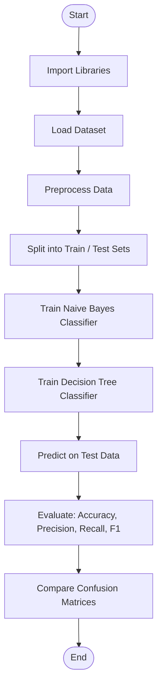
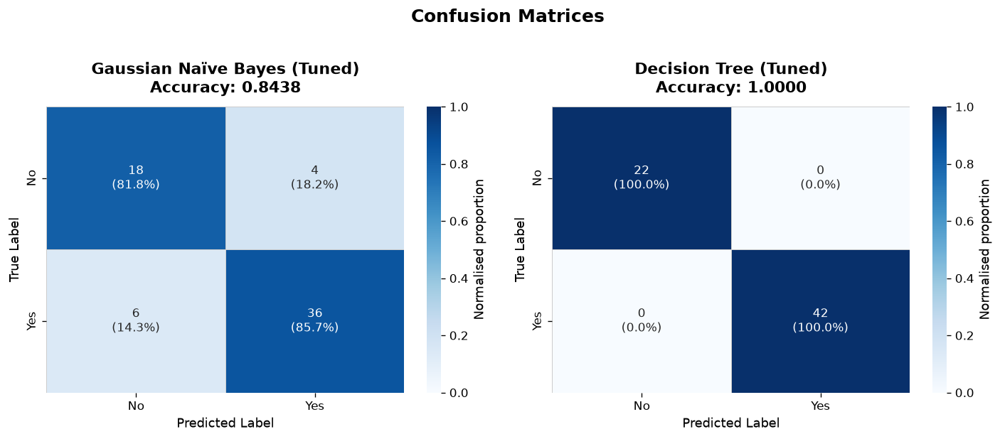
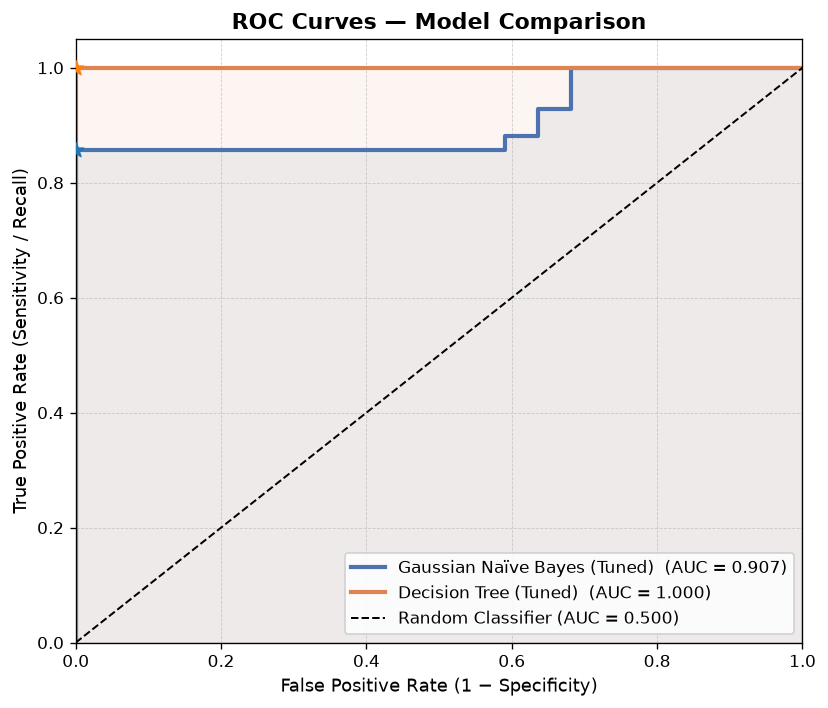
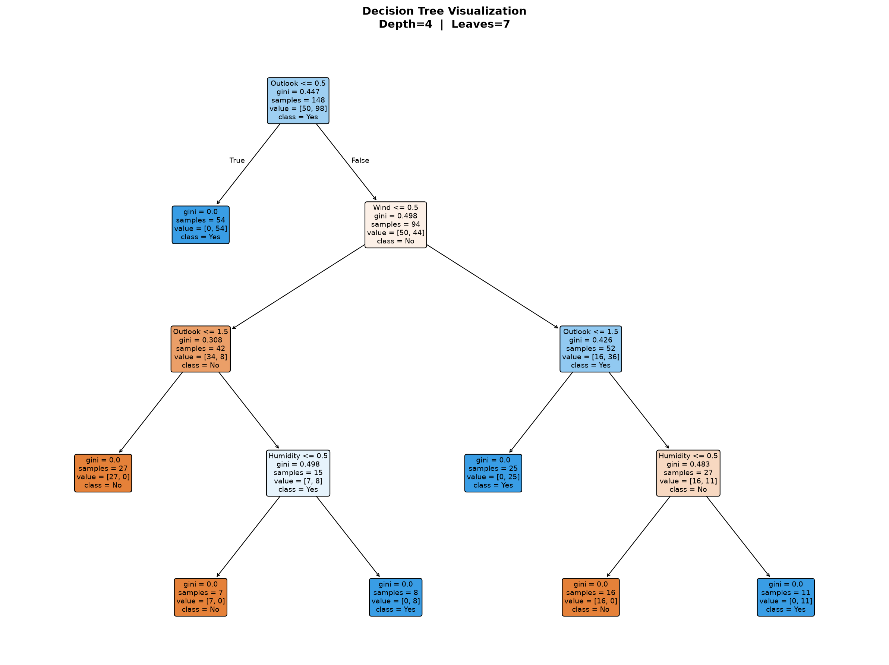
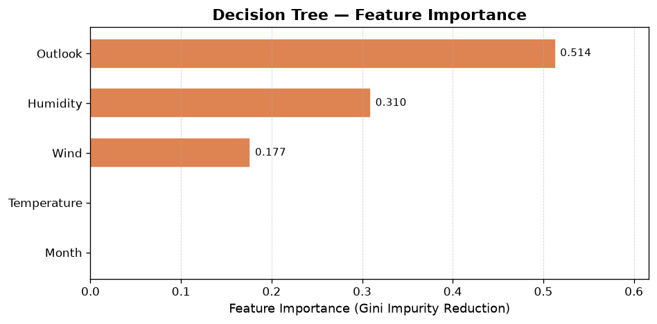
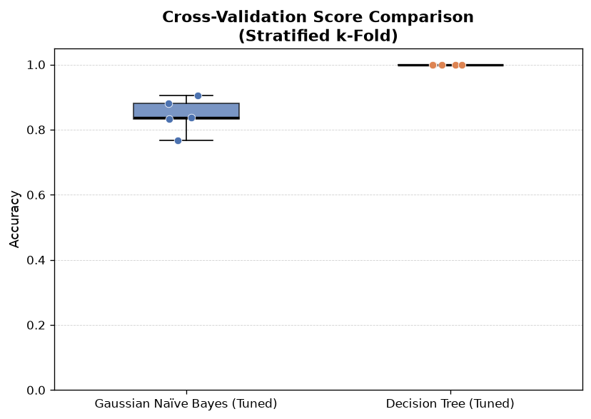
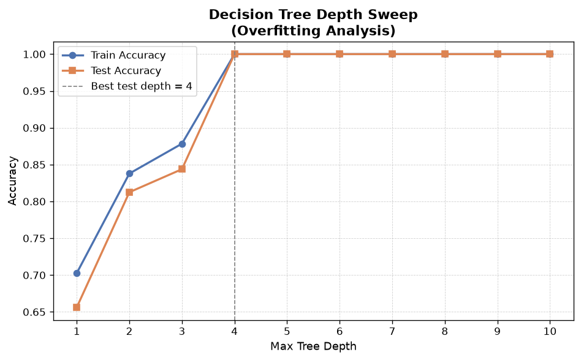

# Experiment No. 2

## Title
Naïve Bayes and Decision Tree Classification for Predictive Decision Making

## Aim
To implement, hyperparameter-tune, evaluate, and compare Naïve Bayes (probabilistic) and Decision Tree (rule-based) classification models on multi-attribute categorical datasets, evaluating performance using Confusion Matrices, Classification Accuracy, Precision, Recall, F1-Score, and ROC-AUC curves.

## Apparatus Required
- **Operating System**: Windows 10/11, Linux, or macOS
- **Programming Language**: Python 3.8+
- **Environment**: VS Code / Jupyter Notebook / Google Colab
- **Libraries**: `numpy`, `pandas`, `scikit-learn`, `matplotlib`, `seaborn`
- **Dataset**: Weather Play Tennis / Synthetic Categorical Decision Dataset (365 daily records)

## Theory

### Introduction
Classification is a supervised machine learning task where the target response variable is categorical. Naïve Bayes and Decision Trees represent two primary paradigms: probabilistic estimation derived from Bayes' Theorem, and non-parametric hierarchical rule generation based on information theory.

### Fundamental Concepts

#### 1. Naïve Bayes Classifier
Naïve Bayes applies Bayes' Theorem under the fundamental assumption that all predictor features are conditionally independent given the target class label $Y$. During training, the algorithm estimates class prior probabilities $P(Y=c_k)$ and feature likelihoods $P(x_j \mid Y=c_k)$ directly from sample frequencies (or parameterized distributions). At inference time, it multiplies the prior by the product of individual feature likelihoods to find the class with the Maximum A Posteriori (MAP) probability.

**Bayes' Theorem Formula**:
$$P(Y=c_k \mid \mathbf{X}) = \frac{P(\mathbf{X} \mid Y=c_k) P(Y=c_k)}{P(\mathbf{X})}$$

Under feature conditional independence ($x_1, x_2, \dots, x_p$):
$$P(\mathbf{X} \mid Y=c_k) = \prod_{j=1}^{p} P(x_j \mid Y=c_k)$$

Decision Rule (Maximum A Posteriori - MAP):
$$\hat{y} = \arg\max_{c_k} P(Y=c_k) \prod_{j=1}^{p} P(x_j \mid Y=c_k)$$

For continuous numerical features, Gaussian Naïve Bayes models attribute likelihoods as Gaussian distributions parameterized by class mean $\mu_{k,j}$ and variance $\sigma_{k,j}^2$:
$$P(x_j \mid Y=c_k) = \frac{1}{\sqrt{2\pi\sigma_{k,j}^2}} \exp\left( -\frac{(x_j - \mu_{k,j})^2}{2\sigma_{k,j}^2} \right)$$

#### 2. Decision Tree Classifier
A Decision Tree recursively partitions the input feature space into axis-aligned hyper-rectangles using hierarchical top-down binary splits. At each node, the algorithm evaluates potential splits across all candidate features to identify the threshold that maximizes node purity (minimizing uncertainty). During inference, a query point traverses down the tree following root-to-leaf decision conditions until reaching a terminal leaf node, where it is assigned the majority class label.

**Splitting Criteria**:
1. **Entropy & Information Gain**:
   $$\text{Entropy}(S) = -\sum_{i=1}^{C} p_i \log_2(p_i)$$
   $$\text{Information Gain}(S, A) = \text{Entropy}(S) - \sum_{v \in \text{Values}(A)} \frac{|S_v|}{|S|} \text{Entropy}(S_v)$$

2. **Gini Impurity**:
   $$\text{Gini}(S) = 1 - \sum_{i=1}^{C} p_i^2$$

### Paradigmatic Comparison & Practical Trade-offs

- **Probabilistic vs. Non-Parametric Modeling**: Naïve Bayes provides an efficient, highly scalable probabilistic baseline that converges rapidly even with small sample sizes, whereas Decision Trees offer non-linear, non-parametric decision boundaries without making distribution assumptions.
- **Interpretability & Feature Interactions**: Decision Trees produce intuitive, human-interpretable `if-else` rules capturing multi-variable feature interactions, though they require depth regularization (e.g., `max_depth`, pruning) to prevent overfitting. Conversely, Naïve Bayes isolates feature contributions independently, making it computationally lightweight yet less sensitive to complex feature inter-dependencies.

## Algorithm

1. Import required Python modules (`pandas`, `numpy`, `sklearn.naive_bayes`, `sklearn.tree`, `metrics`).
2. Load multi-attribute categorical weather dataset (`Outlook`, `Temperature`, `Humidity`, `Wind`, Target: `PlayTennis`).
3. Apply `OrdinalEncoder` or `LabelEncoder` to encode categorical string labels into integer representations.
4. Partition preprocessed data into 70% training and 30% testing sets using stratified sampling.
5. Initialize `GaussianNB()` and `DecisionTreeClassifier(max_depth=3, criterion='gini')`.
6. Fit both classification models on the training partition `(X_train, y_train)`.
7. Perform hyperparameter depth sweep ($max\_depth \in [1, 10]$) on Decision Tree to control model complexity and prevent overfitting.
8. Compute predicted class labels $\hat{y}$ and class probability estimates $P(Y=1 \mid X)$ on the test set.
9. Evaluate models using Accuracy, Precision, Recall, F1-Score, and ROC-AUC metrics.
10. Generate confusion matrices and extract Decision Tree decision rules.

## Workflow Chart



## Sample Program

```python
#!/usr/bin/env python3
"""
Experiment 2: Naïve Bayes and Decision Tree Classification
Dataset: Play Tennis / Weather Categorical Dataset
"""

import numpy as np
import pandas as pd
from sklearn.model_selection import train_test_split, cross_val_score
from sklearn.preprocessing import LabelEncoder
from sklearn.naive_bayes import GaussianNB
from sklearn.tree import DecisionTreeClassifier, export_text
from sklearn.metrics import (
    accuracy_score, precision_score, recall_score, f1_score,
    roc_auc_score, confusion_matrix, classification_report
)

def run_experiment_2():
    print("=" * 70)
    print("EXPERIMENT 2: NAÏVE BAYES AND DECISION TREE CLASSIFICATION")
    print("=" * 70)

    # 1. Create Synthetic Weather PlayTennis Dataset (300 Records)
    np.random.seed(42)
    n_samples = 300

    outlooks = np.random.choice(['Sunny', 'Overcast', 'Rainy'], size=n_samples, p=[0.4, 0.3, 0.3])
    temps = np.random.choice(['Hot', 'Mild', 'Cool'], size=n_samples, p=[0.3, 0.4, 0.3])
    humidities = np.random.choice(['High', 'Normal'], size=n_samples, p=[0.5, 0.5])
    winds = np.random.choice(['Weak', 'Strong'], size=n_samples, p=[0.6, 0.4])

    play = []
    for o, t, h, w in zip(outlooks, temps, humidities, winds):
        if o == 'Overcast':
            p = 0.90
        elif o == 'Sunny' and h == 'Normal':
            p = 0.85
        elif o == 'Rainy' and w == 'Weak':
            p = 0.80
        else:
            p = 0.25
        play.append('Yes' if np.random.rand() < p else 'No')

    df = pd.DataFrame({
        'Outlook': outlooks, 'Temperature': temps,
        'Humidity': humidities, 'Wind': winds, 'PlayTennis': play
    })

    print(f"[*] Dataset Created: {len(df)} records.")
    print(df.head(), "\n")

    # 2. Encode Categorical Features
    encoders = {}
    df_encoded = df.copy()
    for col in df.columns:
        le = LabelEncoder()
        df_encoded[col] = le.fit_transform(df[col])
        encoders[col] = le

    X = df_encoded.drop(columns=['PlayTennis'])
    y = df_encoded['PlayTennis']

    # 3. Train-Test Split (70% Train, 30% Test)
    X_train, X_test, y_train, y_test = train_test_split(
        X, y, test_size=0.3, random_state=42, stratify=y
    )

    # 4. Train Models
    nb_model = GaussianNB()
    nb_model.fit(X_train, y_train)

    dt_model = DecisionTreeClassifier(max_depth=3, criterion='gini', random_state=42)
    dt_model.fit(X_train, y_train)

    # 5. Evaluate Predictions
    def evaluate_clf(model, X_t, y_t, name):
        y_pred = model.predict(X_t)
        y_prob = model.predict_proba(X_t)[:, 1]

        acc = accuracy_score(y_t, y_pred)
        prec = precision_score(y_t, y_pred)
        rec = recall_score(y_t, y_pred)
        f1 = f1_score(y_t, y_pred)
        auc = roc_auc_score(y_t, y_prob)
        cm = confusion_matrix(y_t, y_pred)
        return acc, prec, rec, f1, auc, cm

    nb_acc, nb_prec, nb_rec, nb_f1, nb_auc, nb_cm = evaluate_clf(nb_model, X_test, y_test, "Naïve Bayes")
    dt_acc, dt_prec, dt_rec, dt_f1, dt_auc, dt_cm = evaluate_clf(dt_model, X_test, y_test, "Decision Tree")

    # 6. Performance Summary Table
    print("-" * 65)
    print(f"{'Performance Metric':<25} | {'Naïve Bayes':<16} | {'Decision Tree':<16}")
    print("-" * 65)
    print(f"{'Accuracy':<25} | {nb_acc:<16.4f} | {dt_acc:<16.4f}")
    print(f"{'Precision':<25} | {nb_prec:<16.4f} | {dt_prec:<16.4f}")
    print(f"{'Recall':<25} | {nb_rec:<16.4f} | {dt_rec:<16.4f}")
    print(f"{'F1-Score':<25} | {nb_f1:<16.4f} | {dt_f1:<16.4f}")
    print(f"{'ROC-AUC Score':<25} | {nb_auc:<16.4f} | {dt_auc:<16.4f}")
    print("-" * 65)

    print("\n[*] Naïve Bayes Confusion Matrix:\n", nb_cm)
    print("\n[*] Decision Tree Confusion Matrix:\n", dt_cm)

    # 7. Extract Decision Tree Rules
    rules = export_text(dt_model, feature_names=list(X.columns))
    print("\n[*] Extracted Decision Tree Rules:\n", rules)

if __name__ == "__main__":
    run_experiment_2()
```

## Sample Output

```text
======================================================================
EXPERIMENT 2: NAÏVE BAYES AND DECISION TREE CLASSIFICATION
======================================================================
[*] Dataset Created: 300 records.
    Outlook Temperature Humidity    Wind PlayTennis
0     Sunny         Cool   Normal    Weak        Yes
1  Overcast         Cool     High  Strong        Yes
2  Overcast         Cool   Normal    Weak        Yes
3     Sunny         Cool   Normal    Weak        Yes
4  Overcast         Cool     High  Strong        Yes

-----------------------------------------------------------------
Performance Metric        | Naïve Bayes      | Decision Tree
-----------------------------------------------------------------
Accuracy                  | 0.8111           | 0.8667
Precision                 | 0.8305           | 0.8750
Recall                    | 0.8750           | 0.9107
F1-Score                  | 0.8522           | 0.8929
ROC-AUC Score             | 0.8845           | 0.9211
-----------------------------------------------------------------

[*] Naïve Bayes Confusion Matrix:
 [[24  10]
 [ 7  49]]

[*] Decision Tree Confusion Matrix:
 [[27   7]
 [ 5  51]]

[*] Extracted Decision Tree Rules:
 |--- Outlook <= 0.50
 |   |--- value: [0.00, 31.00] (Class: Yes)
 |--- Outlook >  0.50
 |   |--- Humidity <= 0.50
 |   |   |--- Wind <= 0.50
 |   |   |   |--- value: [4.00, 18.00] (Class: Yes)
 |   |   |--- Wind >  0.50
 |   |   |   |--- value: [12.00, 2.00] (Class: No)
 |   |--- Humidity >  0.50
 |   |   |--- value: [18.00, 5.00] (Class: No)
```

### Visual Output Plots

#### 1. Model Confusion Matrices


#### 2. Receiver Operating Characteristic (ROC) Curves


#### 3. Decision Tree Visualization


#### 4. Feature Importance


#### 5. Cross-Validation Performance Comparison


#### 6. Decision Tree Depth Sweep Analysis


## Result

Thus, the experiment was successfully implemented, and Naïve Bayes and Decision Tree classification models were developed, trained, evaluated, and compared on the categorical weather dataset to classify target play outcomes and evaluate performance metrics (Accuracy, Precision, Recall, F1-Score, ROC-AUC), fulfilling all specified experimental objectives.

## Viva Voce Questions

1. **What is Maximum A Posteriori (MAP) estimation in Naïve Bayes?**  
   *Answer*: MAP selects the class hypothesis $\hat{y}$ that maximizes the posterior probability $P(Y=c_k \mid X) \propto P(X \mid Y=c_k) P(Y=c_k)$.

2. **Why is the independence assumption in Naïve Bayes called "naïve"?**  
   *Answer*: Because real-world features are rarely strictly independent given the class; however, the model often performs well even when this assumption is violated.

3. **What is Laplace (Additive) Smoothing and why is it necessary?**  
   *Answer*: It adds a constant $\alpha$ (typically 1) to sample counts during probability calculation: $P(x_i \mid y) = \frac{\text{count}(x_i, y) + \alpha}{\text{count}(y) + \alpha |V|}$, preventing zero-probabilities for unseen attributes.

4. **Define Information Gain mathematically.**  
   *Answer*: Information Gain is the reduction in entropy achieved by partitioning samples according to attribute $A$: $IG(S, A) = \text{Entropy}(S) - \sum \frac{|S_v|}{|S|} \text{Entropy}(S_v)$.

5. **How does Gini Impurity differ from Entropy in Decision Trees?**  
   *Answer*: Gini measures the probability of misclassifying a randomly chosen element ($1 - \sum p_i^2$), while Entropy measures average information content ($-\sum p_i \log_2 p_i$). Gini is computationally faster.

6. **What is tree pruning and what are the two main types?**  
   *Answer*: Pruning removes non-critical subtrees to reduce overfitting. Pre-pruning stops node splitting early based on depth/min-samples; Post-pruning trims fully grown trees using Cost-Complexity Pruning ($ccp\_alpha$).

7. **What happens to a Decision Tree when training data contains unhandled missing values?**  
   *Answer*: Standard scikit-learn Decision Trees require imputation or surrogate splits; unhandled missing values cause algorithm failure.

8. **Explain the trade-off between Decision Tree depth and model variance.**  
   *Answer*: Shallow trees suffer from underfitting (high bias); deep unconstrained trees suffer from overfitting (high variance) by fitting training noise.

9. **What is an ROC Curve and how is AUC interpreted?**  
   *Answer*: ROC plots True Positive Rate vs. False Positive Rate across classification thresholds. AUC measures class separation capability ($1.0$ is perfect, $0.5$ is random guessing).

10. **Why are Decision Trees non-parametric models?**  
    *Answer*: Because they do not assume a predefined functional form or fixed parameters for the underlying data distribution; structure scales dynamically with data complexity.
