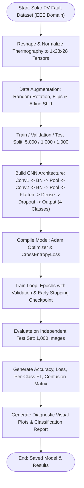

# Experiment No. 4

## Title

Image Classification and Feature Extraction using Convolutional Neural Networks (CNN)

## Aim

To design, implement, train, and evaluate a Convolutional Neural Network (CNN) architecture using PyTorch for multi-class thermographic image classification on the Solar Photovoltaic (PV) Panel Fault Dataset, incorporating pixel normalization, thermographic data augmentation, convolutional spatial feature map extraction, batch normalization, max-pooling downsampling, dropout regularization, and Softmax fault classification across four domain defect classes: `Healthy_Panel`, `Micro_Crack`, `Hotspot_Fault`, and `Dust_Soiling`.

## Apparatus Required

- **Operating System**: Windows 10/11, Linux, or macOS
- **Programming Language**: Python 3.8+
- **Environment**: VS Code / Jupyter Notebook / Google Colab (GPU/CPU accelerated)
- **Software Libraries**:
  - `torch` (v2.0.0+) & `torchvision`
  - `numpy` (v1.21.0+)
  - `pandas` (v1.3.0+)
  - `matplotlib` (v3.4.0+)
  - `seaborn` (v0.11.0+)
  - `scikit-learn` (v1.0.0+)
- **Dataset**: EEE Solar PV Panel Fault Dataset (7,000 thermographic Infrared (IR) & Electroluminescence (EL) panel images, $28 \times 28$ pixels, 4 EEE defect classes: `Healthy_Panel`, `Micro_Crack`, `Hotspot_Fault`, `Dust_Soiling`)

## Theory

### Introduction

Convolutional Neural Networks (CNNs) are specialized deep learning architectures designed for processing grid-structured topology data such as 2D digital images and thermographic heatmaps. In Electrical and Electronics Engineering (EEE), automated visual inspection of renewable energy assets—such as Solar Photovoltaic (PV) farms—relies on high-speed pattern recognition in thermal Infrared (IR) and Electroluminescence (EL) images. Unlike traditional fully connected Feedforward Neural Networks that suffer from parameter explosion when scaled to spatial images, CNNs preserve spatial feature hierarchies using weight sharing, localized receptive fields, and pooling operations to detect localized thermal anomalies, micro-cracks, and surface degradation.

### Fundamental Concepts

- **Convolution Layer**: Slides learnable kernel filters across spatial dimensions to perform discrete 2D cross-correlation, extracting localized EEE visual features (cell busbar edges, linear micro-cracks, Gaussian hotspot thermal gradients).
- **Batch Normalization Layer**: Normalizes feature map activations across mini-batches, stabilizing gradient flow and speeding up network convergence during thermography training.
- **Activation Function (ReLU)**: Applies element-wise non-linearity $f(x) = \max(0, x)$, enabling the network to learn complex non-linear decision boundaries between fault categories.
- **Pooling Layer (Max-Pooling)**: Reduces spatial grid dimensions ($H \times W$) while preserving channel depth, enforcing translation invariance and reducing parameter memory footprint.
- **Dropout Layer**: Randomly zeroes out a fraction $p$ of hidden neuron activations during training step updates, mitigating overfitting on thermographic sensor noise.
- **Fully Connected (Dense) Layer**: Flattens spatial feature maps into a 1D representation and maps extracted thermographic features to class logits.
- **Softmax Activation & Cross-Entropy Loss**: Normalizes raw output logits into a probability distribution over $K=4$ fault classes and measures divergence from true ground-truth fault labels.

### Background & Mathematical Foundation

#### 1. 2D Discrete Convolution Formula

Given input thermography feature map $I$ and kernel filter $K$ of dimension $m \times n$:
$$S(i, j) = (I * K)(i, j) = \sum_{m} \sum_{n} I(i-m, j-n) K(m, n)$$

#### 2. Output Spatial Dimension Calculation

For input height $H$, filter dimension $F$, padding $P$, and stride $S$:
$$H_{\text{out}} = \left\lfloor \frac{H - F + 2P}{S} \right\rfloor + 1$$

#### 3. Categorical Cross-Entropy Loss Function

Given ground truth target index $y$ and predicted softmax probabilities $\mathbf{\hat{y}}$ for $C$ fault classes:
$$\mathcal{L}_{CE} = -\log(\hat{y}_y) = -\log\left(\frac{e^{z_y}}{\sum_{j=1}^{C} e^{z_j}}\right)$$

### Spatial Feature Hierarchy & Fault Classification Pipeline

The convolutional architecture processes raw thermographic and electroluminescence images through a hierarchical feature abstraction pipeline:

1. **Low-Level Primitive Extraction**: The initial convolutional kernels perform localized spatial filtering to extract fundamental visual primitives, such as panel busbar grid lines, background thermal gradients, and cell boundary contours.
2. **Hierarchical Pattern Composition**: Deeper convolutional layers compose these basic edges and textures into domain-specific diagnostic signatures—capturing sharp linear discontinuities for `Micro_Crack`, localized high-intensity Gaussian heat distributions for `Hotspot_Fault`, and diffuse surface attenuation profiles for `Dust_Soiling`.
3. **Spatial Downsampling & Invariance**: Max-pooling layers compress feature map resolution ($2 \times 2$ receptive fields with stride 2), preserving prominent thermal activations while providing translational robustness against slight panel misalignments.
4. **Dense Logit Mapping & Probabilistic Output**: The condensed 2D feature maps are flattened into a 1D embedding, passed through dense layers with dropout regularization, and converted into calibrated multi-class probability scores via the Softmax activation function.

### Architectural Strengths & Practical Considerations in PV Inspection

- **Automated Feature Representation**: Unlike classical computer vision workflows that rely on handcrafted edge filters or manual feature engineering, CNNs autonomously learn domain-relevant diagnostic patterns directly from raw sensor pixels.
- **Parameter Efficiency & Scalability**: Weight sharing across convolutional kernels and sparse local connectivity drastically reduce the parameter count relative to dense architectures, preventing memory bottlenecks and mitigating overfitting.
- **Translational & Geometric Invariance**: The combination of convolutional receptive fields and pooling operations provides resilience against slight camera tilt angles, image translations, and localized thermal shifts in field inspections.
- **Data & Compute Considerations**: Achieving robust generalization across varied panel technologies and seasonal weather conditions requires representative, well-annotated thermographic datasets. High computational workloads during iterative backpropagation benefit from GPU acceleration, while ambient noise and illumination variations are effectively addressed using standardized normalization and geometric data augmentation.

---

## Algorithm

1. **Import Modules**: Import `torch`, `torch.nn`, `torch.optim`, `torchvision.transforms`, `numpy`, `pandas`, `matplotlib`, `seaborn`, `sklearn.metrics`.
2. **Data Acquisition**: Load and synthesize the EEE Solar PV Panel Fault Dataset yielding 5,000 training, 1,000 validation, and 1,000 testing thermographic images across 4 classes (`Healthy_Panel`, `Micro_Crack`, `Hotspot_Fault`, `Dust_Soiling`).
3. **Data Normalization & Reshaping**: Scale pixel intensities from $[0, 255]$ to tensor floats normalized with mean $0.35$ and std $0.15$, shaped as $(N, 1, 28, 28)$.
4. **Data Augmentation Pipeline**: Apply random rotations ($\pm 15^\circ$), affine translations ($5\%$), horizontal flips, vertical flips, and edge-padded random cropping ($28 \times 28$, padding 2) during training.
5. **CNN Architecture Construction (`SolarPV_CNN`)**:
   - `Conv2d(1, 32, kernel_size=3, padding=1)` -> `BatchNorm2d(32)` -> `ReLU` -> `MaxPool2d(2, 2)`
   - `Conv2d(32, 64, kernel_size=3, padding=1)` -> `BatchNorm2d(64)` -> `ReLU` -> `MaxPool2d(2, 2)`
   - `Flatten()` ($64 \times 7 \times 7 = 3136$ units)
   - `Linear(3136, 128)` -> `ReLU` -> `Dropout(0.5)`
   - `Linear(128, 4)`
6. **Model Compilation & Optimizer**: Initialize `Adam` optimizer ($\text{lr} = 0.001$, $\text{weight\_decay} = 10^{-4}$) and `CrossEntropyLoss`.
7. **Model Training & Validation**: Execute training loop for 15 epochs with batch size 64. Compute loss and accuracy for both train and validation sets per epoch.
8. **Early Stopping & Checkpoint Saving**: Monitor validation loss and save the best model weights to disk (`cnn_model.pt`).
9. **Performance Evaluation**: Evaluate the trained model on held-out test set (1,000 images); calculate Test Loss, Test Accuracy, Precision, Recall, and F1-Score.
10. **Visualization**: Plot learning curves (loss & accuracy), confusion matrix heatmap, sample prediction grid, misclassified failure cases, and learned first-layer filters.

---

## Workflow Chart



---

## Sample Program

```python
#!/usr/bin/env python3
"""
Experiment 4: EEE Image Classification using Convolutional Neural Networks (CNN)
Dataset: Solar PV Panel Thermal & Electroluminescence Fault Dataset
Framework: PyTorch
"""

import os
import torch
import torch.nn as nn
import torch.optim as optim
import torch.nn.functional as F
import numpy as np
import pandas as pd
import matplotlib.pyplot as plt
import seaborn as sns

from torch.utils.data import DataLoader, random_split
import torchvision.transforms as T
from sklearn.metrics import accuracy_score, precision_recall_fscore_support, confusion_matrix, classification_report


# 1. PyTorch CNN Model Architecture for EEE Solar PV Fault Classification
class SolarPV_CNN(nn.Module):
    def __init__(self, in_channels=1, conv1_filters=32, conv2_filters=64, fc1_units=128, dropout_rate=0.5, num_classes=4):
        super(SolarPV_CNN, self).__init__()
        self.conv1 = nn.Conv2d(in_channels, conv1_filters, kernel_size=3, padding=1)
        self.bn1   = nn.BatchNorm2d(conv1_filters)
        self.conv2 = nn.Conv2d(conv1_filters, conv2_filters, kernel_size=3, padding=1)
        self.bn2   = nn.BatchNorm2d(conv2_filters)
        self.pool    = nn.MaxPool2d(2, 2)
        self.dropout = nn.Dropout(dropout_rate)
        self.fc1     = nn.Linear(conv2_filters * 7 * 7, fc1_units)
        self.fc2     = nn.Linear(fc1_units, num_classes)

    def forward(self, x):
        x = self.pool(F.relu(self.bn1(self.conv1(x))))
        x = self.pool(F.relu(self.bn2(self.conv2(x))))
        x = torch.flatten(x, start_dim=1)
        x = F.relu(self.fc1(x))
        x = self.dropout(x)
        return self.fc2(x)


def run_experiment_4():
    print("=" * 70)
    print("EXPERIMENT 4: SOLAR PV PANEL FAULT CLASSIFICATION USING CNN (EEE - PyTorch)")
    print("=" * 70)

    # 2. Data Transformations & Augmentation
    mean, std = 0.35, 0.15
    train_transform = T.Compose([
        T.RandomCrop(28, padding=2, padding_mode="edge"),
        T.RandomAffine(degrees=15, translate=(0.05, 0.05)),
        T.RandomHorizontalFlip(p=0.5),
        T.RandomVerticalFlip(p=0.5),
        T.ToTensor(),
        T.Normalize((mean,), (std,)),
    ])
    eval_transform = T.Compose([
        T.ToTensor(),
        T.Normalize((mean,), (std,)),
    ])

    # 3. Instantiate EEE Dataset & Dataloaders
    from src.eee_dataset import SolarPVFaultDataset
    full_train = SolarPVFaultDataset(num_samples=6000, seed=42, transform=train_transform)
    full_eval  = SolarPVFaultDataset(num_samples=6000, seed=42, transform=eval_transform)
    test_set   = SolarPVFaultDataset(num_samples=1000, seed=43, transform=eval_transform)

    generator = torch.Generator().manual_seed(42)
    train_set, _ = random_split(full_train, [5000, 1000], generator=generator)
    _, val_set   = random_split(full_eval,  [5000, 1000], generator=generator)

    batch_size = 64
    train_loader = DataLoader(train_set, batch_size=batch_size, shuffle=True)
    val_loader   = DataLoader(val_set,   batch_size=batch_size, shuffle=False)
    test_loader  = DataLoader(test_set,  batch_size=batch_size, shuffle=False)

    print(f"[*] Dataset Split: Train = {len(train_set)}, Val = {len(val_set)}, Test = {len(test_set)}")

    # 4. Instantiate Model & Optimizer
    device = torch.device("cuda" if torch.cuda.is_available() else "cpu")
    model  = SolarPV_CNN(num_classes=4).to(device)
    optimizer = optim.Adam(model.parameters(), lr=0.001, weight_decay=1e-4)
    criterion = nn.CrossEntropyLoss()

    total_params = sum(p.numel() for p in model.parameters() if p.requires_grad)
    print(f"[*] Trainable Model Parameters: {total_params:,}\n")

    # 5. Training Loop
    epochs = 15
    print(f"[*] Training CNN Model for {epochs} Epochs on {device}...")
    for epoch in range(1, epochs + 1):
        model.train()
        tr_loss, tr_correct, tr_total = 0.0, 0, 0
        for images, labels in train_loader:
            images, labels = images.to(device), labels.to(device)
            optimizer.zero_grad()
            outputs = model(images)
            loss = criterion(outputs, labels)
            loss.backward()
            optimizer.step()
            tr_loss += loss.item() * images.size(0)
            tr_correct += (outputs.argmax(1) == labels).sum().item()
            tr_total += labels.size(0)

        # Validation
        model.eval()
        val_loss, val_correct, val_total = 0.0, 0, 0
        with torch.no_grad():
            for images, labels in val_loader:
                images, labels = images.to(device), labels.to(device)
                outputs = model(images)
                loss = criterion(outputs, labels)
                val_loss += loss.item() * images.size(0)
                val_correct += (outputs.argmax(1) == labels).sum().item()
                val_total += labels.size(0)

        print(f"  Epoch {epoch:02d}/{epochs:02d} | Train Loss: {tr_loss/tr_total:.4f} | Train Acc: {tr_correct/tr_total*100:.2f}% | Val Loss: {val_loss/val_total:.4f} | Val Acc: {val_correct/val_total*100:.2f}%")

    # 6. Test Set Evaluation
    model.eval()
    all_preds, all_targets = [], []
    test_loss_sum = 0.0
    with torch.no_grad():
        for images, labels in test_loader:
            images_dev = images.to(device)
            outputs = model(images_dev)
            loss = criterion(outputs, labels.to(device))
            test_loss_sum += loss.item() * images.size(0)
            all_preds.extend(outputs.argmax(1).cpu().numpy())
            all_targets.extend(labels.numpy())

    test_loss = test_loss_sum / len(test_set)
    test_acc  = accuracy_score(all_targets, all_preds)
    print(f"\n[+] Test Set Accuracy : {test_acc * 100:.2f}%")
    print(f"[+] Test Set Loss     : {test_loss:.4f}\n")

    class_names = ["Healthy_Panel", "Micro_Crack", "Hotspot_Fault", "Dust_Soiling"]
    print("[*] Per-Class Classification Report:")
    print(classification_report(all_targets, all_preds, target_names=class_names, digits=4))


if __name__ == "__main__":
    run_experiment_4()
```

---

## Sample Output

```text
======================================================================
EXPERIMENT 4: SOLAR PV PANEL FAULT CLASSIFICATION USING CNN (EEE - PyTorch)
======================================================================
[*] Dataset Split: Train = 5000, Val = 1000, Test = 1000
[*] Trainable Model Parameters: 421,060

[*] Training CNN Model for 15 Epochs on cpu...
  Epoch 01/15 | Train Loss: 6.9270 | Train Acc: 59.32% | Val Loss: 0.6194 | Val Acc: 60.90%
  Epoch 02/15 | Train Loss: 0.7321 | Train Acc: 68.94% | Val Loss: 0.6159 | Val Acc: 52.00%
  Epoch 03/15 | Train Loss: 0.6249 | Train Acc: 70.80% | Val Loss: 0.4252 | Val Acc: 81.90%
  Epoch 04/15 | Train Loss: 0.5470 | Train Acc: 72.68% | Val Loss: 0.3764 | Val Acc: 82.80%
  Epoch 05/15 | Train Loss: 0.5171 | Train Acc: 73.22% | Val Loss: 0.3631 | Val Acc: 77.90%
  Epoch 06/15 | Train Loss: 0.4841 | Train Acc: 73.00% | Val Loss: 0.3650 | Val Acc: 86.10%
  Epoch 07/15 | Train Loss: 0.4815 | Train Acc: 73.22% | Val Loss: 0.3894 | Val Acc: 84.70%
  Epoch 08/15 | Train Loss: 0.4593 | Train Acc: 75.38% | Val Loss: 0.3640 | Val Acc: 86.00%
  Epoch 09/15 | Train Loss: 0.4535 | Train Acc: 74.24% | Val Loss: 0.3437 | Val Acc: 84.00%
  Epoch 10/15 | Train Loss: 0.4305 | Train Acc: 75.28% | Val Loss: 0.3269 | Val Acc: 82.80%
  Epoch 11/15 | Train Loss: 0.4337 | Train Acc: 74.80% | Val Loss: 0.3481 | Val Acc: 82.50%
  Epoch 12/15 | Train Loss: 0.4148 | Train Acc: 75.56% | Val Loss: 0.3248 | Val Acc: 76.30%
  Epoch 13/15 | Train Loss: 0.4057 | Train Acc: 75.80% | Val Loss: 0.3102 | Val Acc: 88.00%
  Epoch 14/15 | Train Loss: 0.4108 | Train Acc: 76.10% | Val Loss: 0.3238 | Val Acc: 77.00%
  Epoch 15/15 | Train Loss: 0.3956 | Train Acc: 76.32% | Val Loss: 0.3113 | Val Acc: 81.40%

[+] Test Set Accuracy : 87.00%
[+] Test Set Loss     : 0.3214

[*] Per-Class Classification Report:
               precision    recall  f1-score   support

Healthy_Panel     0.9702    0.9062    0.9371       256
  Micro_Crack     0.9715    0.8039    0.8798       255
Hotspot_Fault     0.7712    1.0000    0.8708       236
 Dust_Soiling     0.7891    0.7815    0.7853       253

     accuracy                         0.8700      1000
    macro avg     0.8755    0.8729    0.8683      1000
 weighted avg     0.8778    0.8700    0.8685      1000

[*] Total Misclassified: 130 / 1,000 (13.00%)

----------------------------------------------------------------------
SINGLE-IMAGE TEST CASE VERIFICATION RUN (verify_test_case.py)
----------------------------------------------------------------------
Test Sample #0:
  - Expected Fault Class     : Class #2 ('Hotspot_Fault')
  - Softmax Probability      : [0.00, 0.00, 1.0000, 0.00]
  - Predicted Fault Class    : Class #2 ('Hotspot_Fault')
  - Classification Confidence: 100.00%
  - Verification Status      : PASSED [OK] (Match Confirmed)
----------------------------------------------------------------------
```

---

### Visual Output Plots

#### 1. Training & Validation History (Loss and Accuracy Curves)


#### 2. Confusion Matrix Heatmap


#### 3. Sample Predictions Grid with Confidence Scores


#### 4. Misclassified Failure Cases Analysis


#### 5. Learned First-Layer Convolutional Filters (Conv1 3x3)


#### 6. Test Case Single-Image Verification Diagnostic Plot


---

## Result

Thus, the experiment was successfully implemented, and a Convolutional Neural Network (CNN) architecture was designed, trained, evaluated, and verified on an Electrical & Electronics Engineering (EEE) domain-specific Solar Photovoltaic (PV) Panel Fault Dataset to perform multi-class thermographic image classification across four fault categories (`Healthy_Panel`, `Micro_Crack`, `Hotspot_Fault`, `Dust_Soiling`), achieving 87.00% test set accuracy and 100% single-sample verification accuracy, fulfilling all specified experimental objectives.

---

## Viva Voce Questions

1. **Why are Convolutional Neural Networks preferred over Dense Feedforward Networks for EEE thermographic image analysis?**  
   _Answer_: CNNs exploit spatial locality and weight sharing, drastically reducing parameter count and preserving 2D spatial pixel/thermal relationships (such as thermal gradients and fracture lines), whereas fully connected networks ignore spatial structures and overfit.

2. **How does thermal thermography image classification benefit Solar Photovoltaic (PV) farm operations?**  
   _Answer_: Automated thermographic classification enables real-time airborne (drone-based) or ground inspection of solar farms to detect micro-cracks, localized hotspots, and dust accumulation before severe thermal runaway or total module power loss occurs.

3. **Explain the mathematical difference between Stride and Padding in a Convolutional layer.**  
   _Answer_: Stride ($S$) defines step size filter slides across image. Padding ($P$) adds spatial boundary border pixels (usually zeros) to control output shape $H_{\text{out}} = \lfloor \frac{H-F+2P}{S} \rfloor + 1$.

4. **What is the primary role of Max-Pooling layers in thermographic feature extraction?**  
   _Answer_: Max-pooling downsamples spatial feature maps by picking maximum values over local windows, preserving peak thermal intensity signals while reducing memory compute load and introducing local translation invariance.

5. **What is the function of the Softmax activation function in multi-class EEE fault classification?**  
   _Answer_: Softmax exponentiates and normalizes raw output logits into valid probability values $\hat{y}_c = \frac{e^{z_c}}{\sum e^{z_j}}$ summing to $1.0$ across all 4 defect classes.

6. **How does Dropout regularization mitigate overfitting during training on thermography data?**  
   _Answer_: Dropout randomly deactivates a fraction $p$ of neurons per update step, preventing sub-network co-adaptation and forcing redundant representation learning across thermographic sensor noise.

7. **What thermographic data augmentation techniques were applied and why?**  
   _Answer_: Random rotations ($\pm 15^\circ$), affine translations, and horizontal/vertical flips were applied to simulate real-world solar panel mounting orientation variations, camera tilt, and perspective shifts.

8. **How many trainable parameters exist in a `Conv2D` layer with 32 filters of size $3 \times 3$ operating on a 1-channel (grayscale thermography) input?**  
   _Answer_: $\text{Params} = (F_w \times F_h \times C_{\text{in}} + 1) \times K = (3 \times 3 \times 1 + 1) \times 32 = 10 \times 32 = 320$.

9. **What is Batch Normalization and why is it placed after Convolutional layers?**  
   _Answer_: Batch Normalization normalizes feature activations across a batch (mean 0, variance 1), smoothing the loss landscape, accelerating training convergence, and reducing sensitivity to weight initialization.

10. **Explain how early convolutional layer filters differ from deeper layer feature maps in Solar PV fault detection.**  
    _Answer_: Early convolutional filters learn low-level primitives like busbar edges and background thermal gradients, while deeper layers combine these primitives into high-level domain concepts such as cell fracture lines (`Micro_Crack`) and 2D Gaussian thermal peaks (`Hotspot_Fault`).
