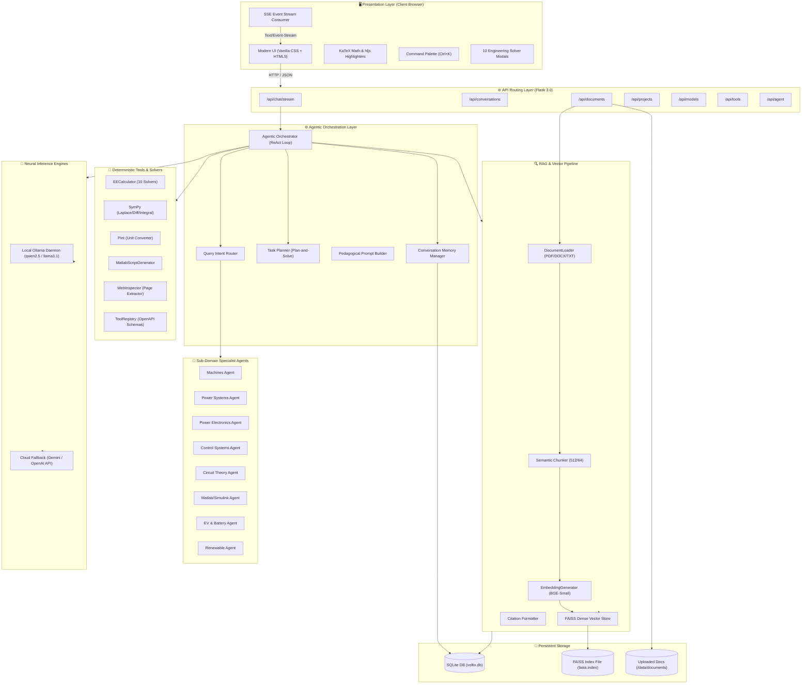
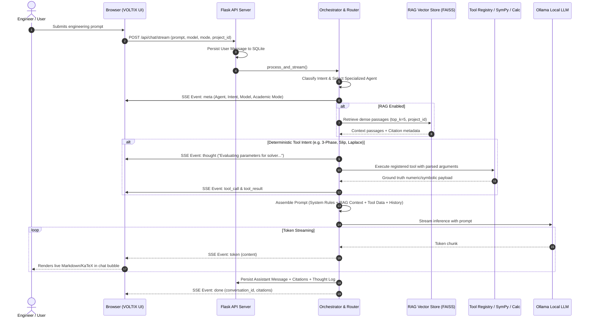
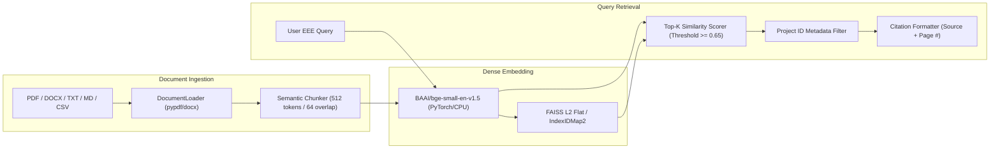

<div align="center">

# ⚡ VOLTIX

### **Domain-Specific Conversational AI & Autonomous Engineering Copilot for Electrical, Electronics, Power & Energy Systems**

[](https://www.python.org/)
[](https://flask.palletsprojects.com/)
[](https://github.com/facebookresearch/faiss)
[](https://ollama.ai/)
[](https://www.sympy.org/)
[](https://pint.readthedocs.io/)
[](tests/)
[](LICENSE)

---

[Key Features](#-key-features) •
[System Architecture](#-system-architecture) •
[Engineering Solvers](#-deterministic-engineering-solvers) •
[RAG Pipeline](#-dense-rag--document-intelligence) •
[API Reference](#-complete-api-reference) •
[Getting Started](#-getting-started) •
[Project Structure](#-project-structure)

---

</div>

## 📌 Executive Overview

**VOLTIX** is a production-grade, offline-first conversational AI platform and agentic engineering assistant engineered specifically for **Electrical and Electronics Engineering (EEE)**. Generic Large Language Models frequently suffer from critical domain deficiencies: hallucinating complex circuit equations, miscalculating three-phase power angles, confusing unit prefixes (e.g., $\text{kV}$ vs $\text{mV}$, $\mu\text{F}$ vs $\text{pF}$), and failing to generate syntactically valid MATLAB/Simulink simulation scripts.

VOLTIX solves these fundamental challenges by pairing **local, privacy-preserving LLMs (via Ollama)** with an **autonomous ReAct multi-agent coordinator**, a **dense FAISS vector retrieval-augmented generation (RAG) engine**, and **deterministic computation pipelines** (SymPy symbolic calculus, Pint unit conversion, and formulaic engineering calculators). 

Wrapped in a conversational user interface inspired by modern AI interaction standards, VOLTIX provides electrical engineers, researchers, and students with verified, citation-backed answers, step-by-step mathematical derivations, and ready-to-run simulation code.

---

## 🎯 Problem Statement vs. VOLTIX Solution

```
┌───────────────────────────────────────────────┬─────────────────────────────────────────────────────────────┐
│          GENERIC LLM LIMITATIONS              │                     VOLTIX SOLUTION                         │
├───────────────────────────────────────────────┼─────────────────────────────────────────────────────────────┤
│ ❌ Hallucinates numerical calculations        │ ✅ Exact deterministic solvers with step-by-step arithmetic │
│ ❌ Unit conversion errors & prefix drops      │ ✅ Pint-backed physical dimensional analysis (35+ aliases)  │
│ ❌ Cannot verify transient/Laplace stability  │ ✅ SymPy symbolic math for pole-zero & BIBO stability checks│
│ ❌ Generic, hallucinated code snippets        │ ✅ Synthesizes executable MATLAB scripts & Simulink models │
│ ❌ Leaks sensitive schematics to third parties │ ✅ 100% offline-capable local inference via Ollama          │
│ ❌ Flat context mixing across domains         │ ✅ Project-isolated semantic vector stores (FAISS + BGE)    │
└───────────────────────────────────────────────┴─────────────────────────────────────────────────────────────┘
```

---

## ⚡ Key Features

### 🧠 1. Multi-Agent Domain Specialization
VOLTIX deploys an intelligent intent router that classifies incoming technical queries with zero latency and delegates reasoning to 10 specialized domain agents:
- **Machines Agent**: Induction motor slip, synchronous machines, DC drives, torque-speed profiles.
- **Power Systems Agent**: Load flow, transmission line parameters, fault analysis, power factor correction.
- **Power Electronics Agent**: Buck, Boost, Buck-Boost, Flyback converters, inverter PWM topologies.
- **Control Systems Agent**: Transfer functions, Bode frequency response, Laplace transforms, BIBO stability.
- **Circuit Theory Agent**: Ohm's Law, KVL/KCL, Thevenin/Norton equivalents, series/parallel RLC transients.
- **MATLAB & Simulink Agent**: Executable `.m` script synthesis and structured Simscape block blueprints.
- **Electric Vehicle (EV) Agent**: Powertrain sizing, battery pack kWh, C-rate discharge, vehicle range.
- **Renewable Energy Agent**: Solar PV array sizing, fill factor (FF), irradiance MPPT calculations.
- **Battery & Storage Agent**: State-of-Charge (SoC), C-rate thermal limits, cell balancing models.
- **Analog & Digital Electronics Agent**: Op-Amps, BJT/MOSFET small-signal models, filter stages.

### 🔬 2. Deterministic Engineering Calculation Engines
Where LLMs approximate, VOLTIX computes:
- **10 Core EEE Solvers**: Formulaic calculation with parameter parsing, substitution strings, and unit validation.
- **Symbolic Calculus**: Algebraic equation solving, definite/indefinite integration, differentiation up to $n$-th order.
- **Frequency Domain Engine**: Unilateral Laplace and Inverse Laplace transforms with partial fraction expansions.
- **Control System Stability**: Pole-zero extraction and characteristic equation root analysis.
- **RLC Transient Analysis**: Damping factor ($\alpha$), natural frequency ($\omega_0$), and classification (Overdamped, Critically Damped, Underdamped).

### 📚 3. Dense RAG & Project-Isolated Vector Indexing
- **Semantic Text Chunker**: Context-aware chunking ($512$ tokens with $64$ overlap) tailored for technical datasheets, IEEE papers, and circuit manuals.
- **BGE Embeddings**: Employs `BAAI/bge-small-en-v1.5` dense embeddings ($384$-dimensional vectors).
- **FAISS Vector Store**: Fast L2/Inner-Product vector indexing with on-disk metadata persistence.
- **Strict Project Isolation**: Filter embeddings and conversations by workspace to avoid cross-project noise.
- **Verbatim Citations**: Direct document snippet and page-number referencing in generated answers.

### 🎨 4. Modern Conversational Web Interface
- **2-Panel AI Architecture**: Collapsible sidebar with chronological chat history alongside a focused conversation viewport.
- **Real-Time SSE Streaming**: Server-Sent Events delivering live token generation and transparent reasoning thought chains.
- **Interactive Tool Accordions**: Visual collapsing widgets detailing agent thought, tool calls, and returned parameters.
- **LaTeX & Code Highlighting**: Automatic KaTeX rendering for math equations ($\KaTeX$) and syntax highlighting for MATLAB/Python/C++.
- **Command Palette (`Ctrl+K`)**: Rapid navigation and shortcut execution across models, solvers, projects, and settings.
- **Theme Engine**: Seamless switching between deep slate dark mode and clean daylight mode.

---

## 🏗️ System Architecture

VOLTIX operates on a layered, event-driven architecture connecting browser interactions to local neural models and scientific computation engines.



---

## 🔄 Chat Request & Agentic Execution Lifecycle

Every user prompt follows a verifiable multi-step execution pipeline before streaming tokens back to the interface:



---

## 🧮 Deterministic Engineering Solvers

VOLTIX includes 10 standalone, mathematically verified engineering solvers that can be triggered directly via API, modal popups, or autonomous agent tool calls:

| Solver Name | Formula / Physics Model | Solved Outputs | Key Inputs |
|:---|:---|:---|:---|
| **Three-Phase Power** | $P = \sqrt{3} V_L I_L \cos\varphi$ | Active ($P$), Reactive ($Q$), Apparent ($S$), Current ($I_L$) | $V_L, I_L \text{ or } P, \text{pf}$ |
| **Single-Phase AC Power** | $P = V I \cos\varphi,\; Q = V I \sin\varphi$ | Real ($P$), Reactive ($Q$), Apparent ($S$) | $V, I, \text{pf}$ |
| **Ohm's Law & Dissipation** | $V = I R,\; P = V I = I^2 R = \frac{V^2}{R}$ | Unknown variable ($V, I, \text{or } R$) + Power ($P$) | Any 2 of ($V, I, R$) |
| **Induction Motor Slip** | $s = \frac{N_s - N_r}{N_s} \times 100\%$ | Slip in per-unit ($\text{pu}$) and percentage ($\%$) | $N_s \text{ (RPM)}, N_r \text{ (RPM)}$ |
| **Synchronous Speed** | $N_s = \frac{120 \cdot f}{P}$ | Stator magnetic field velocity | Frequency ($f$), Poles ($P$) |
| **Shaft Mechanical Torque** | $T = \frac{P}{\omega} = \frac{60 \cdot P}{2\pi N}$ | Developed torque ($N\cdot m$), Angular velocity ($\omega$) | Power ($W$), Speed ($\text{RPM}$) |
| **Transformer Efficiency & VR** | $\eta = \frac{x S \cos\varphi}{x S \cos\varphi + P_i + x^2 P_{cu}},\; \text{VR} = \frac{V_{nl}-V_{fl}}{V_{fl}}$ | Efficiency ($\%$) at fractional load ($x$), Regulation ($\%$) | Rating, $P_i, P_{cu}, \text{pf}, x$ |
| **Power Factor Correction** | $Q_c = P(\tan\varphi_1 - \tan\varphi_2),\; C = \frac{Q_c}{2\pi f V^2}$ | Required bank rating ($k\text{VAR}$), Capacitance ($\mu\text{F}$) | $P \text{ (kW)}, \text{pf}_1, \text{pf}_2, V, f$ |
| **DC-DC Converter Design** | $\text{Buck: } D = \frac{V_o}{V_{in}},\; \text{Boost: } D = 1 - \frac{V_{in}}{V_o}$ | Duty Cycle ($D$), Filter Inductance ($L$), Capacitance ($C$), $L_{crit}$ | $V_{in}, V_o, I_o, f_s$ |
| **Battery & EV Sizing** | $\text{Energy} = V \cdot Ah,\; I_{dis} = C_{rate} \cdot Ah,\; \text{Range} = \frac{\text{Wh}}{\text{Wh/km}}$ | Battery kWh, Discharge Current ($A$), Discharge Time, Range ($\text{km}$) | $V, Ah, C\text{-rate}, \text{Wh/km}$ |
| **Solar PV Panel Sizing** | $P_{mp} = V_{mp} \cdot I_{mp},\; \text{FF} = \frac{P_{mp}}{V_{oc} \cdot I_{sc}}$ | Peak Watts ($W_p$), Fill Factor ($\%$), Array module count | $V_{oc}, I_{sc}, V_{mp}, I_{mp}, kW_{target}$ |

### Symbolic Mathematics & Calculus via SymPy

```python
# Algebraic Equation Solving
SymPySolver.solve_equation("s**2 + 2*s + 5 = 0", variable_str="s")
# -> Solutions: [-1 - 2*I, -1 + 2*I]

# Unilateral Laplace Transform
SymPySolver.laplace_transform("exp(-3*t) * cos(4*t)")
# -> Frequency Domain: (s + 3)/((s + 3)**2 + 16)

# Transfer Function Stability Analysis
SymPySolver.transfer_function_analysis(num_str="10", den_str="s**3 + 4*s**2 + 5*s + 2")
# -> Poles: [-2, -1, -1] | BIBO Stable: True
```

---

## 📂 Dense RAG & Document Intelligence

VOLTIX implements a localized Retrieval-Augmented Generation pipeline designed to index dense technical datasheets and textbooks without leaking proprietary schematics to public clouds.



---

## 🔌 Complete API Reference

All backend endpoints are namespaced under `/api` and return standardized JSON responses.

### 1. Chat & Streaming Engine

| Method | Endpoint | Description | Request Payload | Response / Stream |
|:---|:---|:---|:---|:---|
| `POST` | `/api/chat/stream` | Core SSE streaming conversation endpoint with autonomous ReAct execution | `{"prompt": str, "model": str, "academic_mode": str, "project_id": str, "enable_rag": bool}` | `text/event-stream` yielding JSON payloads (`meta`, `thought`, `tool_call`, `tool_result`, `token`, `done`) |

### 2. Conversation Sessions

| Method | Endpoint | Description | Request Payload / Query | Response Format |
|:---|:---|:---|:---|:---|
| `GET` | `/api/conversations/` | List all conversation sessions | `?project_id=<id>` | `[{"id": str, "title": str, "model_used": str, "message_count": int, ...}]` |
| `GET` | `/api/conversations/search` | Search sessions by title or content | `?q=<search_query>` | `[{"id": str, "title": str, ...}]` |
| `POST` | `/api/conversations/` | Initialize a new conversation | `{"title": str, "model": str, "academic_mode": str, "project_id": str}` | `{"id": str, "title": str, ...}` (201 Created) |
| `GET` | `/api/conversations/<id>` | Fetch conversation message history | None | `{"id": str, "messages": [{"sender": str, "content": str, ...}]}` |
| `PATCH` | `/api/conversations/<id>` | Update title or academic mode | `{"title": str, "academic_mode": str}` | `{"id": str, "title": str, ...}` |
| `GET` | `/api/conversations/<id>/export` | Export chat transcript | `?format=markdown|json` | File download (`.md` or `.json`) |
| `DELETE` | `/api/conversations/<id>` | Permanently delete a conversation | None | `{"message": "Conversation deleted successfully"}` |

### 3. RAG Documents & Vector Indexing

| Method | Endpoint | Description | Request Payload | Response Format |
|:---|:---|:---|:---|:---|
| `GET` | `/api/documents/` | List all indexed documents | `?project_id=<id>` | `[{"id": str, "filename": str, "page_count": int, "total_chunks": int, ...}]` |
| `POST` | `/api/documents/upload` | Ingest, chunk, embed, and index file | `multipart/form-data` (`file`, `project_id`) | `{"message": str, "document": {...}}` (201 Created) |
| `DELETE` | `/api/documents/<id>` | Delete document and unindex vectors | None | `{"message": "Document deleted and unindexed successfully"}` |

### 4. Project Workspaces

| Method | Endpoint | Description | Request Payload | Response Format |
|:---|:---|:---|:---|:---|
| `GET` | `/api/projects/` | List all engineering projects | None | `[{"id": str, "name": str, "description": str, "notes": str, ...}]` |
| `POST` | `/api/projects/` | Create a new project workspace | `{"name": str, "description": str, "notes": str}` | `{"id": str, "name": str, ...}` (201 Created) |
| `GET` | `/api/projects/<id>` | Get project details with documents & chats | None | `{"id": str, "conversations": [...], "documents": [...]}` |
| `PUT` | `/api/projects/<id>` | Update project metadata or notes | `{"name": str, "description": str, "notes": str}` | `{"id": str, "name": str, ...}` |
| `DELETE` | `/api/projects/<id>` | Delete project workspace | None | `{"message": "Project deleted successfully"}` |

### 5. Models & Health Discovery

| Method | Endpoint | Description | Parameters | Response Format |
|:---|:---|:---|:---|:---|
| `GET` | `/api/models/` | Get available local & cloud models | None | `{"default_model": str, "local_models": [...], "model_matrix": {...}}` |
| `GET` | `/api/models/health` | Check local Ollama daemon status & latency | None | `{"status": "online", "latency_ms": float, "installed_models": [...]}` |

### 6. Engineering Solvers & Scientific Calculators

| Method | Endpoint | Description | Request Payload |
|:---|:---|:---|:---|
| `POST` | `/api/tools/three-phase-power` | 3-Phase power & line current solver | `{"p": float, "vl": float, "il": float, "pf": float}` |
| `POST` | `/api/tools/single-phase-power` | Single-phase AC real/reactive power | `{"v": float, "i": float, "pf": float}` |
| `POST` | `/api/tools/ohms-law` | Ohm's Law and dissipation solver | `{"v": float, "i": float, "r": float}` (provide any 2) |
| `POST` | `/api/tools/slip` | Induction motor slip calculator | `{"ns": float, "n": float}` |
| `POST` | `/api/tools/synchronous-speed` | Synchronous speed calculator | `{"f": float, "p": int}` |
| `POST` | `/api/tools/motor-torque` | Shaft torque & angular velocity | `{"power_w": float, "speed_rpm": float}` |
| `POST` | `/api/tools/transformer` | Transformer efficiency & regulation | `{"rating_kva": float, "pf": float, "p_iron_w": float, "p_cu_fl_w": float, "fraction_load": float, "v_nl": float, "v_fl": float}` |
| `POST` | `/api/tools/power-factor-correction` | Capacitor kVAR & capacitance sizing | `{"active_power_kw": float, "initial_pf": float, "target_pf": float, "voltage_v": float, "freq_hz": float}` |
| `POST` | `/api/tools/dc-dc-converter` | Buck / Boost CCM component sizing | `{"topology": "Buck"|"Boost", "vin": float, "vout": float, "iout": float, "freq_hz": float}` |
| `POST` | `/api/tools/battery-ev` | Battery energy, discharge current & range | `{"voltage_v": float, "capacity_ah": float, "c_rate": float, "wh_per_km": float}` |
| `POST` | `/api/tools/solar-pv` | Solar PV peak power, fill factor & array | `{"voc": float, "isc": float, "vmp": float, "imp": float, "target_kw": float}` |
| `POST` | `/api/tools/sympy/solve` | Symbolic algebraic solver | `{"expression": "s**2 + 3*s + 2 = 0", "variable": "s"}` |
| `POST` | `/api/tools/sympy/diff` | Symbolic differentiation | `{"expression": "sin(omega*t)*exp(-alpha*t)", "variable": "t", "order": 1}` |
| `POST` | `/api/tools/sympy/integrate` | Definite or indefinite integration | `{"expression": "V_m*sin(omega*t)", "variable": "t", "lower": "0", "upper": "pi"}` |
| `POST` | `/api/tools/sympy/laplace` | Unilateral Laplace transform | `{"expression": "exp(-a*t)*cos(w*t)"}` |
| `POST` | `/api/tools/sympy/inverse-laplace` | Inverse Laplace transform | `{"expression": "1 / (s**2 + 4)"}` |
| `POST` | `/api/tools/sympy/transfer-function` | Transfer function pole-zero stability | `{"num": "10", "den": "s**2 + 4*s + 13"}` |
| `POST` | `/api/tools/sympy/rlc` | Series RLC transient analysis | `{"r": 10.0, "l": 0.1, "c": 0.001}` |
| `POST` | `/api/tools/unit-convert` | Physical dimensional unit conversion | `{"value": 1500, "from_unit": "rpm", "to_unit": "rad/s"}` |
| `POST` | `/api/tools/matlab/bode` | Synthesize MATLAB Bode plot script | `{"num": [10], "den": [1, 2, 10], "title": "Filter Bode Plot"}` |
| `POST` | `/api/tools/matlab/torque-speed` | Synthesize induction motor MATLAB script | `{"v_phase": 230, "f": 50, "poles": 4}` |
| `POST` | `/api/tools/matlab/simulink-blueprint` | Structured Simscape model blueprint | `{"topic": "Buck Converter DC-DC Simulation"}` |

### 7. Autonomous Agent & Task Planner

| Method | Endpoint | Description | Request Payload | Response Format |
|:---|:---|:---|:---|:---|
| `POST` | `/api/agent/plan` | Generate multi-step task breakdown for complex problems | `{"query": str, "model": str}` | `{"goal": str, "steps": [{"step": int, "tool": str, "description": str}], ...}` |
| `GET` | `/api/agent/tools` | List registered tools with OpenAPI parameter schemas | None | `{"tools": {...}, "ollama_schemas": [...]}` |
| `GET` | `/api/agent/model-matrix` | Retrieve dynamic tiering matrix | None | `{"router": {...}, "tool_executor": {...}, ...}` |

---

## 💻 Technology Stack

| Category | Technology | Version | Purpose in VOLTIX |
|:---|:---|:---|:---|
| **Web Framework** | Flask | `>=3.0.0` | Core WSGI application, blueprint routing, SSE streaming responses |
| **ORM & Database** | Flask-SQLAlchemy / SQLite | `>=3.1.1` | Relational persistence for conversations, messages, projects, and document metadata |
| **Vector Indexing** | FAISS CPU (`faiss-cpu`) | `>=1.7.4` | Dense vector similarity indexing and L2 distance retrieval |
| **Neural Embeddings** | Sentence-Transformers | `>=2.3.1` | Local inference for `BAAI/bge-small-en-v1.5` dense document embedding |
| **Deep Learning Framework** | PyTorch (`torch`) | `>=2.1.0` | Tensor computation backing embedding models |
| **Local LLM Daemon** | Ollama | Native | Offline LLM inference (`qwen2.5`, `llama3.1`, `deepseek-r1`, `mistral`) |
| **Symbolic Computation** | SymPy | `>=1.12` | Exact mathematical algebra, calculus, Laplace transforms, and pole-zero analysis |
| **Physical Dimensions** | Pint | `>=0.23` | Deterministic unit conversion and EEE dimensional consistency validation |
| **Document Processing** | PyPDF, pdfplumber, python-docx | `>=4.0.0` | Ingestion and text extraction from technical PDFs, Word docs, and datasheets |
| **Web Inspector** | BeautifulSoup4 / Requests | `>=4.12.0` | Live web page scraping and content normalization for URL inspection |
| **Frontend Architecture** | Jinja2 + Vanilla CSS & JS | Native | Modern, responsive interface, zero build-step overhead, theme engine |
| **LaTeX & Math** | KaTeX | CDN (v0.16.8) | Browser-side rendering of complex mathematical expressions and equations |
| **Syntax Highlighting** | Highlight.js | CDN (v11.8.0) | Multi-language syntax highlighting for MATLAB, Python, C++, and JSON |
| **Testing Suite** | Pytest | `>=8.0.0` | Unit, integration, and scenario acceptance test automation (49 test cases) |

---

## 📁 Project Structure

```
voltix/
├── app/                                # Core Application Package
│   ├── __init__.py                     # Flask application factory & blueprint registration
│   ├── config.py                       # Configuration classes (Development, Production)
│   ├── database.py                     # Database connection helpers
│   ├── extensions.py                   # Shared Flask extensions (SQLAlchemy, CORS)
│   │
│   ├── agents/                         # Domain Specialist Sub-Agents
│   │   ├── __init__.py                 # Agent package exports
│   │   ├── planner.py                  # TaskPlanner: Plan-and-Solve multi-step reasoning
│   │   ├── machines_agent.py           # Electrical Machines & Drives specialist
│   │   ├── power_systems_agent.py      # Power Systems, Grid & Load Flow specialist
│   │   ├── power_electronics_agent.py  # Converters, Inverters & Switch-mode specialist
│   │   ├── ev_agent.py                 # Electric Vehicles & Battery Storage specialist
│   │   ├── renewable_agent.py          # Solar PV, Wind & Microgrids specialist
│   │   └── matlab_simulink_agent.py    # MATLAB `.m` and Simulink blueprint synthesizer
│   │
│   ├── llm/                            # Model Integration Layer
│   │   ├── __init__.py                 # Client exports
│   │   ├── base.py                     # Abstract BaseLLMClient interface
│   │   ├── factory.py                  # LLMFactory for provider instantiations
│   │   ├── ollama_client.py            # Local Ollama streaming and tool calling client
│   │   ├── openai_client.py            # Optional OpenAI API client fallback
│   │   ├── gemini_client.py            # Optional Google Gemini API client fallback
│   │   └── model_selector.py           # Intent-to-model dynamic tiering engine
│   │
│   ├── models/                         # SQLAlchemy Relational Models
│   │   ├── __init__.py                 # Model registry exports
│   │   ├── conversation.py             # Conversation & Message entities
│   │   ├── document.py                 # Document & DocumentChunk entities
│   │   ├── project.py                  # Project workspace entity
│   │   ├── settings.py                 # UserSettings entity
│   │   └── tool_log.py                 # ToolExecutionLog entity
│   │
│   ├── rag/                            # Retrieval-Augmented Generation Subsystem
│   │   ├── __init__.py                 # RAG module exports
│   │   ├── loader.py                   # Multi-format document parser (PDF, DOCX, TXT, MD, CSV)
│   │   ├── parser.py                   # Text cleaning & normalization utilities
│   │   ├── chunker.py                  # SemanticChunker (sliding token window)
│   │   ├── embedder.py                 # EmbeddingGenerator (BAAI/bge-small-en-v1.5)
│   │   ├── vector_store.py             # FAISSVectorStore (dense L2 index & metadata)
│   │   ├── retriever.py                # RAGRetriever with similarity thresholds & project filters
│   │   └── citation.py                 # CitationFormatter for grounded references
│   │
│   ├── routes/                         # REST & SSE Route Controllers (Blueprints)
│   │   ├── __init__.py                 # Route blueprint bundle
│   │   ├── main.py                     # Root HTML view router
│   │   ├── chat.py                     # `/api/chat/stream` SSE streaming endpoint
│   │   ├── conversations.py            # `/api/conversations` CRUD & search endpoints
│   │   ├── documents.py                # `/api/documents` upload & vector index endpoints
│   │   ├── projects.py                 # `/api/projects` workspace management endpoints
│   │   ├── models.py                   # `/api/models` discovery & Ollama health check
│   │   ├── tools.py                    # `/api/tools` 10 deterministic EEE solver endpoints
│   │   └── agent.py                    # `/api/agent` planner & tool schema endpoints
│   │
│   ├── services/                       # Business Logic & Pipeline Services
│   │   ├── __init__.py                 # Service exports
│   │   ├── orchestrator.py             # Orchestrator: Central ReAct loop coordinator
│   │   ├── router.py                   # QueryRouter: Intent & keyword classifier
│   │   ├── prompt_builder.py           # PromptBuilder: System instructions & academic modes
│   │   └── memory.py                   # ConversationMemoryManager: Context history buffer
│   │
│   ├── tools/                          # Deterministic Computation Engines
│   │   ├── __init__.py                 # Tool exports
│   │   ├── registry.py                 # ToolRegistry: Decorator-based OpenAPI tool discovery
│   │   ├── ee_calculator.py            # EECalculator: 10 exact formulaic solvers
│   │   ├── sympy_solver.py             # SymPySolver: Symbolic algebra, calculus & Laplace
│   │   ├── unit_converter.py           # UnitConverter: Pint-backed dimensional analyzer
│   │   ├── matlab_generator.py         # MatlabScriptGenerator: Code & Simscape blueprints
│   │   └── web_inspector.py            # WebInspector: Local page scraping & extraction
│   │
│   └── utils/                          # Common Utilities
│       ├── __init__.py                 # Utility exports
│       ├── exceptions.py               # Custom domain exception classes
│       ├── logger.py                   # Structured console & file logging
│       └── validators.py               # File extension & payload sanitizers
│
├── data/                               # Persistent Storage (Git-ignored)
│   ├── db/                             # SQLite databases (`voltix.db`)
│   ├── documents/                      # Raw uploaded engineering files
│   └── vector_store/                   # Serialized FAISS index & metadata pickles
│
├── frontend/                           # Presentation Assets
│   ├── static/
│   │   ├── css/
│   │   │   └── style.css               # Complete tokenized design system (dark/light themes)
│   │   └── js/
│   │       ├── api.js                  # Centralized Fetch API client wrapper
│   │       ├── app.js                  # Application state, theme engine, sidebar & modals
│   │       ├── chat.js                 # SSE streaming consumer, LaTeX rendering & chat UI
│   │       ├── solvers.js              # Interactive solver modal forms & dispatchers
│   │       ├── files.js                # Drag-and-drop document upload & attachment chips
│   │       ├── project.js              # Workspace manager & project switching
│   │       ├── settings.js             # User preferences & API key configuration
│   │       └── ui.js                   # Compatibility stub
│   │
│   └── templates/
│       ├── base.html                   # Master HTML shell (CDNs, SEO, theme prevention)
│       ├── chat.html                   # Primary 2-panel conversational layout & all modals
│       └── components/                 # Reusable Jinja2 partials
│           ├── sidebar.html            # Collapsible navigation drawer
│           ├── calc_modal.html         # 10 Engineering solver tabbed panes
│           ├── project_modal.html      # Workspace management modal
│           ├── settings_modal.html     # Multi-tab settings panel
│           ├── command_palette.html    # Ctrl+K modal overlay
│           └── source_modal.html       # Citation source text inspector
│
├── tests/                              # Automated Test Suite (49 Tests)
│   ├── conftest.py                     # Pytest fixtures & in-memory test clients
│   ├── test_acceptance_scenarios.py    # End-to-end user scenario validation
│   ├── integration/
│   │   ├── test_chat_api.py            # Chat & streaming API tests
│   │   ├── test_projects_api.py        # Workspace CRUD API tests
│   │   └── test_tools_api.py           # REST calculation endpoint tests
│   └── unit/
│       ├── test_chunker.py             # Semantic chunking tests
│       ├── test_citation.py            # Citation generation tests
│       ├── test_ee_calculator.py       # Math accuracy on all 10 solvers
│       ├── test_model_selector.py      # Tiering & model resolution tests
│       ├── test_planner.py             # TaskPlanner JSON schema tests
│       ├── test_prompt_builder.py      # Academic mode persona tests
│       ├── test_router.py              # Intent classification tests
│       ├── test_sympy_solver.py        # Symbolic calculus & Laplace tests
│       ├── test_tool_registry.py       # OpenAPI schema generation tests
│       ├── test_unit_converter.py      # Pint conversion accuracy tests
│       └── test_web_inspector.py       # Web inspector tests
│
├── config.yaml                         # Global system hyperparameters & model matrix
├── requirements.txt                    # Production Python dependencies
├── run.py                              # Application entry point
└── README.md                           # System documentation
```

---

## ⚙️ Environment Configuration & Hyperparameters

VOLTIX reads settings from `config.yaml` and optional overrides from a root `.env` file.

### 1. Environment Variables (`.env`)

```ini
# Application Secrets
SECRET_KEY=voltix-eee-prod-secret-key-2026
FLASK_ENV=development

# Local Ollama Configuration
OLLAMA_BASE_URL=http://localhost:11434
DEFAULT_MODEL=qwen2.5:7b

# Cloud API Keys (Optional Fallbacks)
OPENAI_API_KEY=
GEMINI_API_KEY=

# RAG & Embedding Hyperparameters
EMBEDDING_MODEL=BAAI/bge-small-en-v1.5
TOP_K=5
```

### 2. Hyperparameter Matrix (`config.yaml`)

```yaml
system:
  app_name: "VOLTIX"
  version: "2.0.0"
  debug: true
  host: "0.0.0.0"
  port: 5000

ollama:
  base_url: "http://localhost:11434"
  default_model: "qwen2.5:7b"
  timeout_seconds: 90
  options:
    temperature: 0.1
    top_p: 0.9
    top_k: 40

  # Autonomous Dynamic Tiering Matrix
  models:
    router: "qwen2.5:3b"
    tool_executor: "qwen2.5:7b"
    fast_reasoning: "deepseek-v4-flash:cloud"
    planner: "gemma4:cloud"
    deep_specialist: "gemma4:31b-cloud"
    frontier_reasoning: "gpt-oss:120b-cloud"

agentic:
  max_react_iterations: 5
  enable_planner: true
  enable_web_tools: true

rag:
  embedding_model: "BAAI/bge-small-en-v1.5"
  chunk_size: 512
  chunk_overlap: 64
  top_k: 5
  similarity_threshold: 0.65

storage:
  db_filename: "voltix.db"
  faiss_index_filename: "faiss.index"
  faiss_metadata_filename: "metadata.pkl"
  upload_max_size_mb: 32

logging:
  level: "INFO"
  format: "%(asctime)s - %(name)s - %(levelname)s - %(message)s"
```

---

## 🚀 Getting Started

### Prerequisites
- **Python 3.10+** (Tested on Python 3.10, 3.11, 3.12)
- **Ollama** installed and running locally ([https://ollama.ai/](https://ollama.ai/))
- **Git**

### Step 1: Clone the Repository
```bash
git clone https://github.com/Mekesh-Engineer/Ai_for_Engineers.git
cd Ai_for_Engineers/domain_specific_qa_system_project/voltix
```

### Step 2: Set Up Python Virtual Environment
```bash
# Create virtual environment
python -m venv .venv

# Activate virtual environment
# Windows (PowerShell):
.venv\Scripts\Activate.ps1
# Windows (CMD):
.venv\Scripts\activate.bat
# Linux / macOS:
source .venv/bin/activate
```

### Step 3: Install Dependencies
```bash
python -m pip install --upgrade pip
pip install -r requirements.txt
```

### Step 4: Pull Recommended Local Models via Ollama
Ensure the Ollama service is active (`ollama serve`), then pull the recommended EEE models:
```bash
# Recommended standard model (Fast, highly capable with tools and code)
ollama pull qwen2.5:7b

# Alternative high-speed router model
ollama pull qwen2.5:3b

# Optional reasoning specialist
ollama pull deepseek-r1:8b
```

### Step 5: Launch the VOLTIX Server
```bash
python run.py
```
Output:
```
======================================================================
⚡ VOLTIX — Electrical & Electronics Engineering AI Platform
======================================================================
 * Environment: Development
 * Database:    sqlite:///E:\Projects\AI & ML\domain_specific_qa_system_project\voltix\data\db\voltix.db
 * Vector Store: E:\Projects\AI & ML\domain_specific_qa_system_project\voltix\data\vector_store\faiss.index
 * Ollama Host: http://localhost:11434
 * Model:       qwen2.5:7b
 * Web UI:      http://127.0.0.1:5000
======================================================================
```

Open your browser and navigate to **`http://localhost:5000`**.

---

## 🧪 Verification & Test Suite

VOLTIX includes an automated test suite comprising **49 test cases** across unit, integration, and end-to-end acceptance scenarios.

```bash
# Execute the complete test suite
python -m pytest
```

### Test Coverage Breakdown:
```
tests/integration/test_chat_api.py ......................... [  6%] (Stream validation & error handling)
tests/integration/test_projects_api.py ..................... [  8%] (Workspace isolation & CRUD)
tests/integration/test_tools_api.py ........................ [ 16%] (REST solver calculation integrity)
tests/test_acceptance_scenarios.py ......................... [ 30%] (End-to-end engineering user journeys)
tests/unit/test_chunker.py ................................. [ 32%] (Sliding window token overlap)
tests/unit/test_citation.py ................................ [ 34%] (Context grounding & citation formatting)
tests/unit/test_ee_calculator.py ........................... [ 48%] (Accuracy on all 10 core EEE equations)
tests/unit/test_model_selector.py .......................... [ 61%] (Intent-to-tier model selection matrix)
tests/unit/test_planner.py ................................. [ 65%] (Task decomposition schema generation)
tests/unit/test_prompt_builder.py .......................... [ 67%] (Persona prompt synthesis)
tests/unit/test_router.py .................................. [ 69%] (Zero-latency keyword & intent routing)
tests/unit/test_sympy_solver.py ............................ [ 81%] (Symbolic calculus, Laplace & pole-zero)
tests/unit/test_tool_registry.py ........................... [ 87%] (OpenAPI schema & dynamic dispatch)
tests/unit/test_unit_converter.py .......................... [ 95%] (Pint physical dimension conversions)
tests/unit/test_web_inspector.py ........................... [100%] (Page text extraction & cleaning)

============================= 49 passed in 10.40s =============================
```

---

## 🎓 Academic Modes & Pedagogical Personas

VOLTIX adapts its conversational tone, derivation depth, and explanatory rigor based on the selected **Academic Mode**:

```
┌─────────────────┬────────────────────────────────────────────────────────────────────────────────────────┐
│ Academic Mode   │ Behavioral Adaptation & Output Style                                                   │
├─────────────────┼────────────────────────────────────────────────────────────────────────────────────────┤
│ 📖 Learn        │ Explains underlying physical principles, states laws, presents step-by-step arithmetic │
│                 │ substitutions, and provides intuitive analogical insights for students.               │
├─────────────────┼────────────────────────────────────────────────────────────────────────────────────────┤
│ 📝 Exam Prep    │ Concise, high-yield formula summaries, key assumptions, boundary condition checks,    │
│                 │ and rapid problem-solving shortcuts with standard IEEE notations.                     │
├─────────────────┼────────────────────────────────────────────────────────────────────────────────────────┤
│ 🛠️ Project      │ Production-focused component sizing, standard vendor ratings, safety margins ($1.25\times$),│
│                 │ bill-of-materials considerations, and ready-to-run MATLAB/Simulink code blocks.        │
├─────────────────┼────────────────────────────────────────────────────────────────────────────────────────┤
│ 🔬 Research     │ Rigorous theoretical treatment, transfer function state-space matrices, partial        │
│                 │ differential equations, and verbatim citations from uploaded literature.              │
└─────────────────┴────────────────────────────────────────────────────────────────────────────────────────┘
```

---

## 🛡️ Security, Privacy & Compliance

- **100% On-Premise / Air-Gapped Capable**: All core LLM inference and vector embedding run entirely on local CPU/GPU hardware. No prompts or proprietary engineering datasheets leave your network.
- **Path Traversal Protection**: Uploaded filenames are sanitized via strict alphanumeric regex to prevent directory traversal attacks.
- **SQL Injection Prevention**: All persistent queries utilize SQLAlchemy parameterized ORM queries.
- **Safe Symbolic Execution**: Mathematical formulas evaluated through SymPy are parsed through isolated token sympification rather than insecure Python `eval()`.
- **CORS & Buffer Controls**: Configured with explicit CORS controls and `X-Accel-Buffering: no` headers to prevent reverse-proxy SSE event truncation.

---

## 🚀 Production Deployment & Operations

### Deploying with Gunicorn & Nginx (Linux)

To deploy VOLTIX in a multi-worker production environment:

#### 1. Launch with Gunicorn WSGI:
```bash
gunicorn --workers 4 \
         --worker-class gthread \
         --threads 4 \
         --timeout 120 \
         --bind 0.0.0.0:5000 \
         "app:create_app()"
```

#### 2. Nginx Reverse Proxy Configuration (with SSE streaming support):
```nginx
server {
    listen 80;
    server_name voltix.internal;

    client_max_body_size 32M;

    location / {
        proxy_pass http://127.0.0.1:5000;
        proxy_http_version 1.1;
        proxy_set_header Host $host;
        proxy_set_header X-Real-IP $remote_addr;
        proxy_set_header X-Forwarded-For $proxy_add_x_forwarded_for;

        # Critical settings for Server-Sent Events (SSE) streaming:
        proxy_set_header Connection '';
        proxy_buffering off;
        proxy_cache off;
        chunked_transfer_encoding off;
        proxy_read_timeout 300s;
    }
}
```

---

## 🤝 Contributing

Contributions to expand VOLTIX's solver library, agent personas, or UI capabilities are welcome!

1. Fork the repository.
2. Create a feature branch (`git checkout -b feature/new-solver`).
3. Commit your changes (`git commit -m "feat: add synchronous generator V-curve solver"`).
4. Verify all tests pass (`python -m pytest`).
5. Push to the branch (`git push origin feature/new-solver`).
6. Open a Pull Request.

---

## 📄 License

This project is licensed under the **MIT License** — see the [LICENSE](LICENSE) file for details.

---

<div align="center">

**VOLTIX** — *Bridging the gap between Generative AI and Deterministic Electrical Engineering.*

Developed by **[Mekesh-Engineer](https://github.com/Mekesh-Engineer)**

</div>
