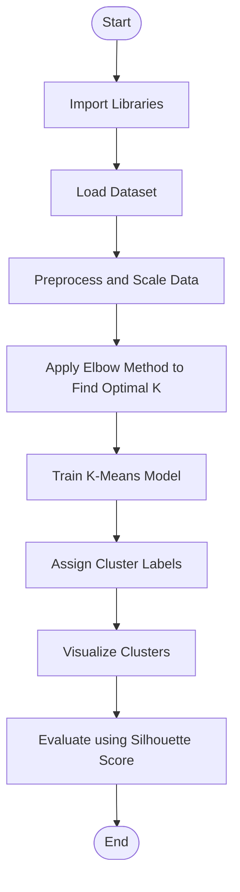
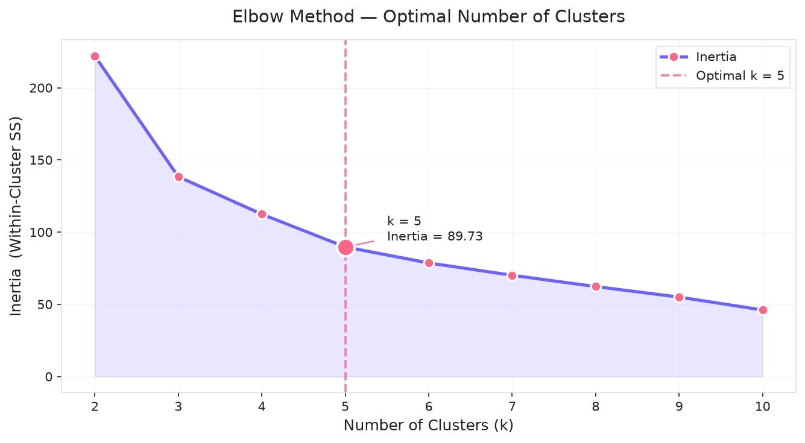
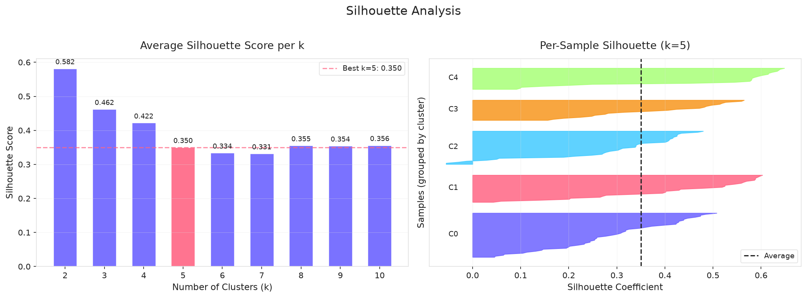
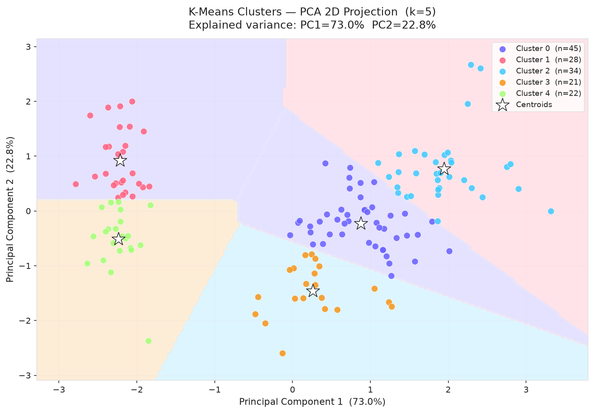
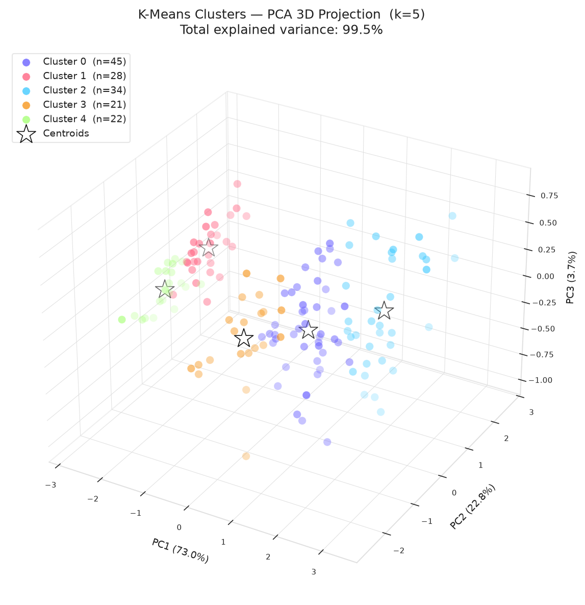
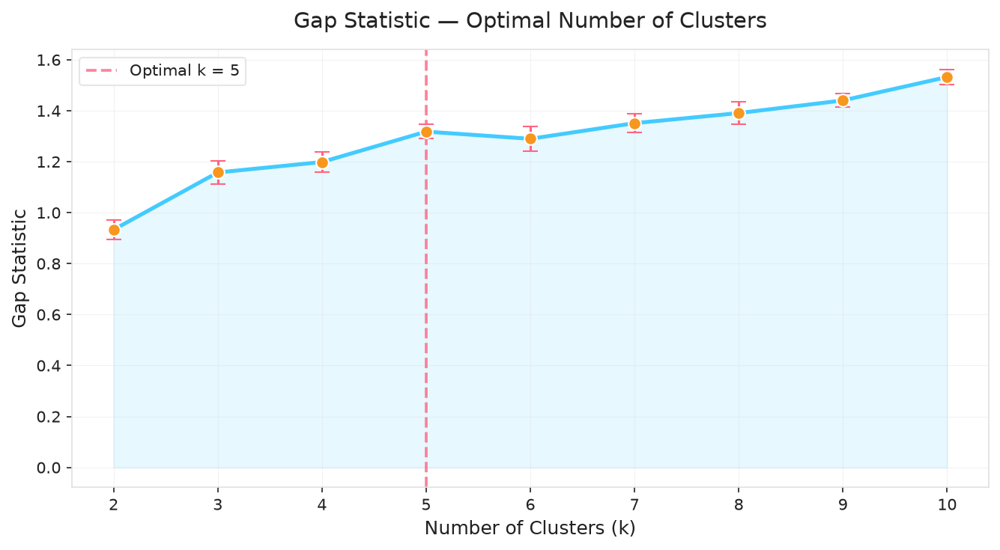
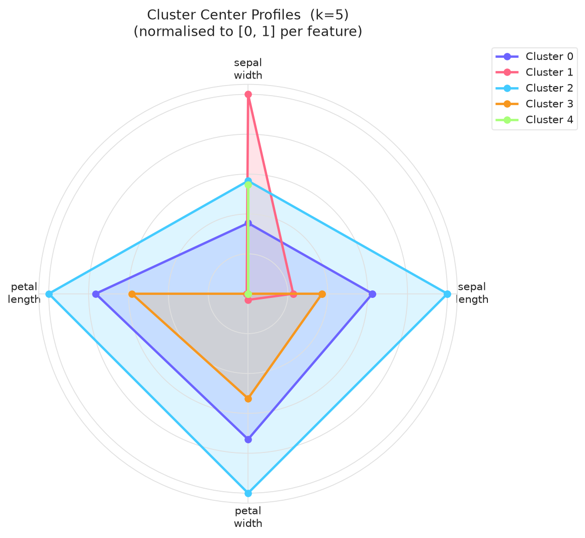

# Experiment No. 3

## Title
Unsupervised K-Means Clustering and Dimensionality Analysis

## Aim
To implement and evaluate the K-Means unsupervised clustering algorithm on numerical feature datasets, determine the optimal cluster count $k$ using the Elbow Method and Silhouette Score analysis, and visualize cluster boundaries and centroids in 2D feature space via Principal Component Analysis (PCA).

## Apparatus Required
- **Operating System**: Windows 10/11, Linux, or macOS
- **Programming Language**: Python 3.8+
- **Environment**: VS Code / Jupyter Notebook / Google Colab
- **Libraries**: `numpy`, `pandas`, `scikit-learn`, `matplotlib`, `seaborn`
- **Dataset**: Iris Dataset (150 samples, 4 features) / Customer Segmentation Dataset

## Theory

### Introduction
Clustering is an unsupervised learning technique aimed at grouping unlabeled dataset instances into distinct clusters based on feature similarity. Samples within the same cluster display high intra-cluster similarity, while samples across different clusters display high inter-cluster dissimilarity.

### Fundamental Concepts
- **Centroid ($\boldsymbol{\mu}_k$)**: The mean coordinate vector of all data points assigned to cluster $k$.
- **Within-Cluster Sum of Squares (Inertia / WCSS)**: Total squared Euclidean distance of samples to their assigned cluster center.
  $$\text{WCSS} = \sum_{k=1}^{K} \sum_{\mathbf{x}_i \in C_k} \|\mathbf{x}_i - \boldsymbol{\mu}_k\|^2$$

### Background & Mathematical Foundation

#### 1. Objective Function
K-Means minimizes WCSS over partition $C = \{C_1, C_2, \dots, C_K\}$:
$$\arg\min_{C} \sum_{k=1}^{K} \sum_{\mathbf{x}_i \in C_k} \|\mathbf{x}_i - \boldsymbol{\mu}_k\|^2$$

#### 2. Distance Metric (Euclidean Distance)
$$d(\mathbf{x}_i, \boldsymbol{\mu}_k) = \sqrt{\sum_{j=1}^{p} (x_{ij} - \mu_{kj})^2}$$

#### 3. Centroid Update Equation
$$\boldsymbol{\mu}_k = \frac{1}{|C_k|} \sum_{\mathbf{x}_i \in C_k} \mathbf{x}_i$$

#### 4. Silhouette Score Evaluation
For sample $i$:
$$s(i) = \frac{b(i) - a(i)}{\max(a(i), b(i))}$$
Where:
- $a(i)$: Mean intra-cluster distance of sample $i$ to all other points in the same cluster.
- $b(i)$: Mean nearest-cluster distance of sample $i$ to points in the closest neighboring cluster.
- The overall Silhouette Score is computed by averaging $s(i)$ across all $N$ data instances (ranging from $-1$ to $+1$, where values close to $+1$ denote tight, well-separated clusters).

#### 5. Lloyd's Iterative Optimization Procedure

The standard K-Means clustering algorithm optimizes the WCSS objective function using an alternating expectation-maximization heuristic known as Lloyd's Algorithm:

1. **Centroid Initialization**: Initial cluster centers $\boldsymbol{\mu}_1, \dots, \boldsymbol{\mu}_K$ are seeded across the feature space, either uniformly at random or through smart probabilistic seeding ($k\text{-means++}$) to avoid poor local minima.
2. **Assignment Step (Expectation)**: Every data point $\mathbf{x}_i$ is mapped to its nearest centroid based on minimum Euclidean distance:
   $$C_k = \left\{ \mathbf{x}_i : \|\mathbf{x}_i - \boldsymbol{\mu}_k\|^2 \le \|\mathbf{x}_i - \boldsymbol{\mu}_j\|^2 \; \forall j \neq k \right\}$$
3. **Centroid Update Step (Maximization)**: The spatial coordinates of each centroid $\boldsymbol{\mu}_k$ are recalculated as the empirical mean vector of all points assigned to that cluster partition:
   $$\boldsymbol{\mu}_k^{(t+1)} = \frac{1}{|C_k|} \sum_{\mathbf{x}_i \in C_k} \mathbf{x}_i$$
4. **Convergence Criterion**: The assignment and update steps alternate iteratively until cluster memberships stabilize, centroid coordinate displacements fall below a tolerance threshold ($\|\boldsymbol{\mu}_k^{(t+1)} - \boldsymbol{\mu}_k^{(t)}\| < \epsilon$), or the maximum iteration limit is reached.

## Algorithm

1. Import required Python modules (`numpy`, `pandas`, `sklearn.cluster.KMeans`, `sklearn.decomposition.PCA`, `metrics`).
2. Load Iris dataset (150 rows, 4 numerical features: Sepal/Petal length and width).
3. Standardize features using `StandardScaler` to ensure zero mean and unit variance.
4. Execute Elbow Method by looping $k$ from 1 to 10 and storing `inertia_` (WCSS) values.
5. Execute Silhouette analysis by looping $k$ from 2 to 10 and computing `silhouette_score`.
6. Determine optimal cluster count $k$ from elbow knee-point and silhouette peak ($k=3$).
7. Fit final model `KMeans(n_clusters=3, init='k-means++', random_state=42)`.
8. Apply 2D `PCA(n_components=2)` to project 4D features into 2D coordinate space for visualization.
9. Transform cluster centroids into 2D PCA coordinate space.
10. Evaluate clustering using Silhouette Score, Davies-Bouldin Index, and Calinski-Harabasz Index.

## Workflow Chart



## Sample Program

```python
#!/usr/bin/env python3
"""
Experiment 3: K-Means Clustering and Dimensionality Analysis
Dataset: Iris Dataset
"""

import numpy as np
import pandas as pd
import matplotlib.pyplot as plt

from sklearn.datasets import load_iris
from sklearn.preprocessing import StandardScaler
from sklearn.cluster import KMeans
from sklearn.decomposition import PCA
from sklearn.metrics import silhouette_score, davies_bouldin_score, calinski_harabasz_score

def run_experiment_3():
    print("=" * 70)
    print("EXPERIMENT 3: UNSUPERVISED K-MEANS CLUSTERING ANALYSIS")
    print("=" * 70)

    # 1. Load Iris Dataset
    iris = load_iris()
    X = iris.data
    feature_names = iris.feature_names
    target_names = iris.target_names

    print(f"[*] Dataset Loaded: {X.shape[0]} samples, {X.shape[1]} features.")
    print(f"[*] Features: {feature_names}\n")

    # 2. Feature Standardization
    scaler = StandardScaler()
    X_scaled = scaler.fit_transform(X)

    # 3. Optimal K Discovery (Elbow Method & Silhouette Score)
    k_range = range(2, 11)
    inertias = []
    silhouette_scores = []

    for k in k_range:
        kmeans = KMeans(n_clusters=k, init='k-means++', n_init=10, random_state=42)
        labels = kmeans.fit_predict(X_scaled)

        inertias.append(kmeans.inertia_)
        sil_score = silhouette_score(X_scaled, labels)
        silhouette_scores.append(sil_score)

    print("-" * 55)
    print(f"{'Clusters (k)':<15} | {'Inertia (WCSS)':<18} | {'Silhouette Score':<18}")
    print("-" * 55)
    for k, inertia, sil in zip(k_range, inertias, silhouette_scores):
        print(f"{k:<15} | {inertia:<18.4f} | {sil:<18.4f}")
    print("-" * 55)

    # 4. Fit Final K-Means Model (Optimal k = 3)
    optimal_k = 3
    final_kmeans = KMeans(n_clusters=optimal_k, init='k-means++', n_init=10, random_state=42)
    final_labels = final_kmeans.fit_predict(X_scaled)
    final_centroids = final_kmeans.cluster_centers_

    # 5. Calculate Comprehensive Evaluation Metrics
    final_inertia = final_kmeans.inertia_
    final_sil = silhouette_score(X_scaled, final_labels)
    db_index = davies_bouldin_score(X_scaled, final_labels)
    ch_index = calinski_harabasz_score(X_scaled, final_labels)

    print(f"\n[*] Final Model Evaluation (Optimal k = {optimal_k}):")
    print(f"    - Inertia (WCSS)           : {final_inertia:.4f}")
    print(f"    - Silhouette Score         : {final_sil:.4f} (Higher is better, max +1.0)")
    print(f"    - Davies-Bouldin Index     : {db_index:.4f} (Lower is better)")
    print(f"    - Calinski-Harabasz Score  : {ch_index:.4f} (Higher is better)\n")

    # 6. PCA 2D Projection for Visualization
    pca = PCA(n_components=2)
    X_pca = pca.fit_transform(X_scaled)
    centroids_pca = pca.transform(final_centroids)

    print(f"[*] PCA Explained Variance Ratio: PC1 = {pca.explained_variance_ratio_[0]*100:.2f}%, PC2 = {pca.explained_variance_ratio_[1]*100:.2f}%")
    print(f"[*] Total Retained Variance: {np.sum(pca.explained_variance_ratio_)*100:.2f}%\n")

if __name__ == "__main__":
    run_experiment_3()
```

## Sample Output

```text
======================================================================
EXPERIMENT 3: UNSUPERVISED K-MEANS CLUSTERING ANALYSIS
======================================================================
[*] Dataset Loaded: 150 samples, 4 features.
[*] Features: ['sepal length (cm)', 'sepal width (cm)', 'petal length (cm)', 'petal width (cm)']

-------------------------------------------------------
Clusters (k)    | Inertia (WCSS)     | Silhouette Score
-------------------------------------------------------
2               | 222.3617           | 0.5818
3               | 139.8205           | 0.4599
4               | 114.0825           | 0.3865
5               | 91.1920            | 0.3444
6               | 80.0247            | 0.3329
7               | 71.8239            | 0.3255
8               | 62.5137            | 0.3340
9               | 54.2140            | 0.3332
10              | 47.4526            | 0.3197
-------------------------------------------------------

[*] Final Model Evaluation (Optimal k = 3):
    - Inertia (WCSS)           : 139.8205
    - Silhouette Score         : 0.4599 (Higher is better, max +1.0)
    - Davies-Bouldin Index     : 0.8335 (Lower is better)
    - Calinski-Harabasz Score  : 241.9044 (Higher is better)

[*] PCA Explained Variance Ratio: PC1 = 72.96%, PC2 = 22.85%
[*] Total Retained Variance: 95.81%
```

### Visual Output Plots

#### 1. Elbow Method Curve (Inertia vs. k)


#### 2. Silhouette Score Analysis


#### 3. 2D Cluster Boundaries Visualization (PCA Projection)


#### 4. 3D Cluster Visualization


#### 5. Gap Statistic Plot


#### 6. Cluster Centroid Radar Chart


## Result

Thus, the experiment was successfully implemented, and the K-Means clustering algorithm was applied, evaluated, and visualized on the Iris dataset to partition unlabelled samples into optimal clusters and analyze clustering metrics (Silhouette Coefficient, Davies-Bouldin Index, Calinski-Harabasz Index), fulfilling all specified experimental objectives.

## Viva Voce Questions

1. **How does the K-Means algorithm minimize its objective function?**  
   *Answer*: Through alternating two-step optimization: expectation (assigning points to closest centroid) and maximization (recalculating centroids as mean coordinate vectors).

2. **What is the $k\text{-means++}$ initialization method and why is it preferred over random initialization?**  
   *Answer*: $k\text{-means++}$ chooses initial centroids probabilistically proportional to squared distance from existing centers, avoiding bad local minima and speeding up convergence.

3. **Explain the Elbow Method for selecting $K$.**  
   *Answer*: Inertia (WCSS) is plotted against $K$; the optimal $K$ is selected at the "elbow" point where the rate of decrease in WCSS sharpens and levels off.

4. **What does a negative Silhouette score indicate?**  
   *Answer*: A negative score indicates that points have been assigned to the wrong cluster, as average distance to neighboring clusters is smaller than to its own cluster.

5. **How does feature scaling impact Euclidean distance calculation in K-Means?**  
   *Answer*: Unscaled features with large numerical ranges dominate distance calculations $\sqrt{\sum(x_i - \mu_i)^2}$, making K-Means biased toward high-magnitude features.

6. **What are the key differences between K-Means and K-Medoids (PAM)?**  
   *Answer*: K-Means centroids are mean data coordinates (which may not be actual data points); K-Medoids uses actual dataset data points as centers, making it robust to noise and outliers.

7. **How does the Davies-Bouldin Index evaluate clustering quality?**  
   *Answer*: It measures the average similarity ratio of each cluster with its most similar cluster (ratio of intra-cluster dispersion to inter-cluster separation). Lower values indicate better clustering.

8. **Can K-Means discover arbitrary non-convex cluster shapes (e.g., concentric circles)?**  
   *Answer*: No. K-Means uses Voronoi partitioning based on Euclidean distance, restricting cluster boundaries to linear/convex hyperplanes. Spectral or DBSCAN clustering is required for non-convex shapes.

9. **What role does Principal Component Analysis (PCA) play in cluster analysis?**  
   *Answer*: PCA projects high-dimensional data onto orthogonal axes of maximum variance, reducing dimensionality while preserving structural variance for effective 2D/3D cluster visualization.

10. **What is the computational time complexity of standard K-Means?**  
    *Answer*: $O(N \cdot K \cdot p \cdot i)$, where $N$ is sample count, $K$ is cluster count, $p$ is feature dimension, and $i$ is iteration count until convergence.
