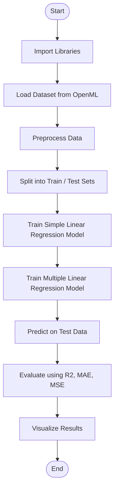
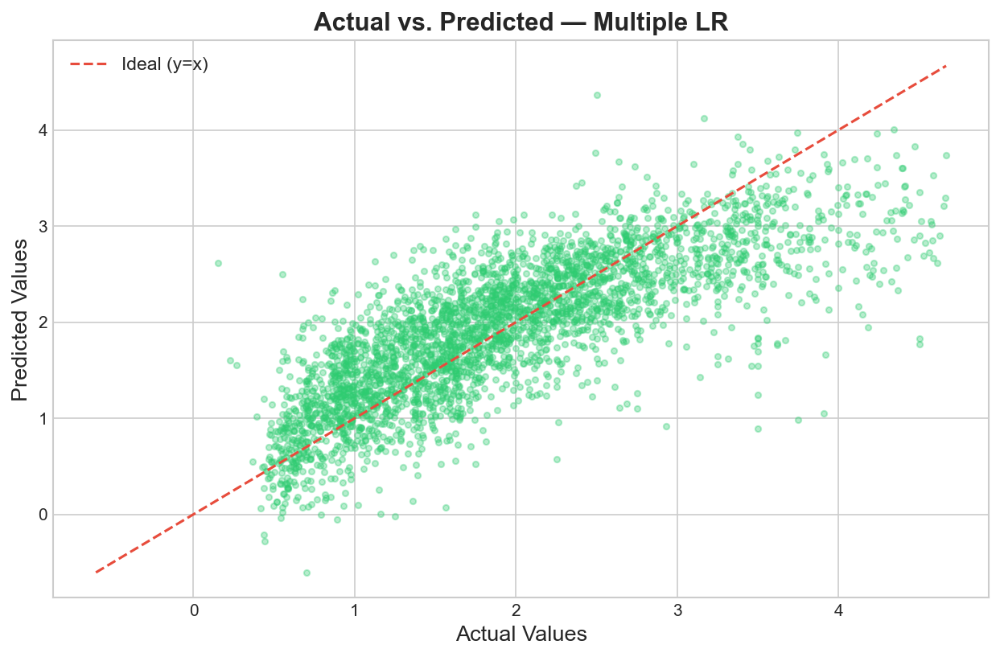
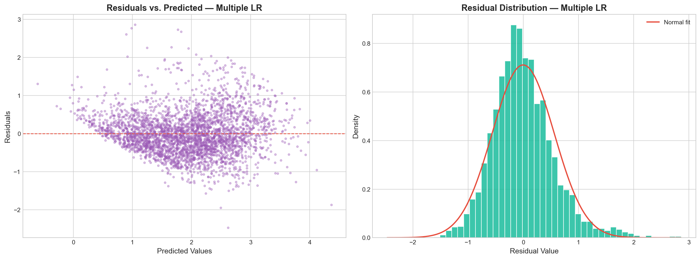
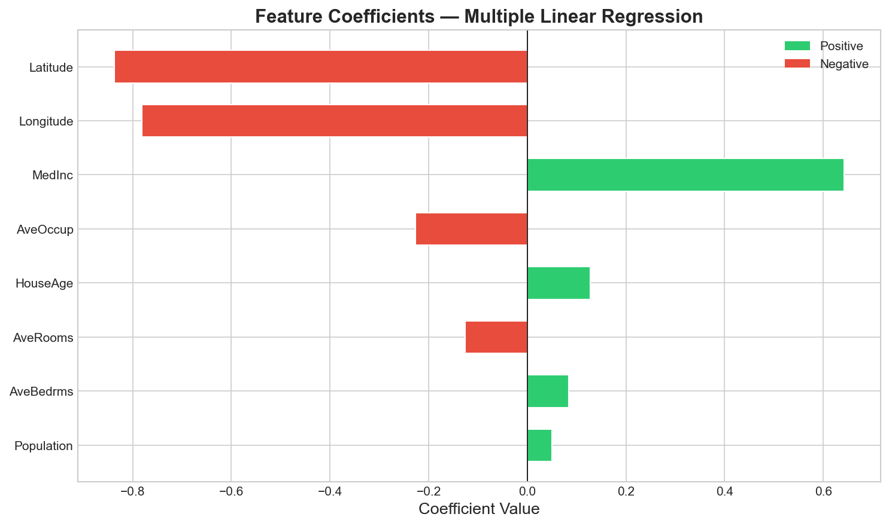
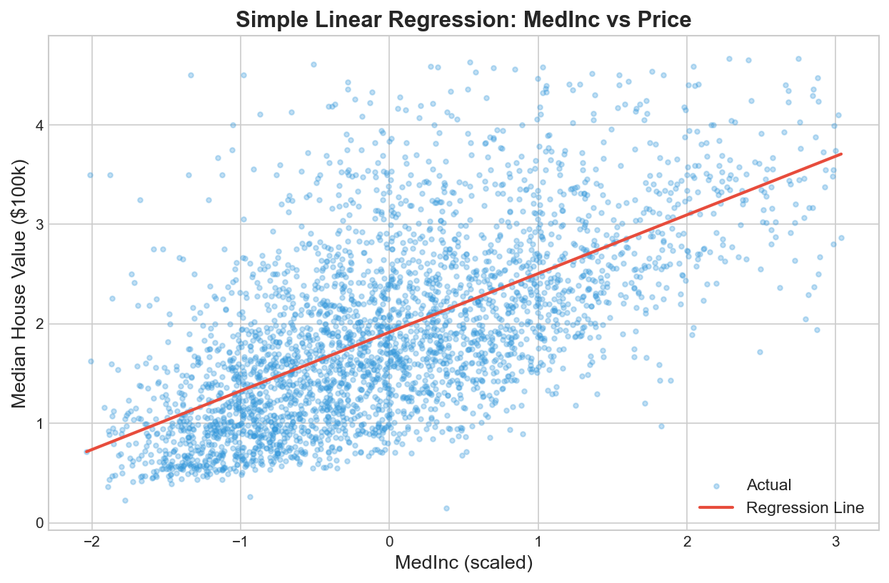

# Experiment No. 1

## Title

Simple and Multiple Linear Regression Analysis for Real Estate Price Prediction

## Aim

To develop, train, evaluate, and compare Simple (univariate) and Multiple (multivariate) Linear Regression models for continuous target variable prediction using scikit-learn, and to evaluate performance metrics including R² Score, Mean Squared Error (MSE), Root Mean Squared Error (RMSE), and Mean Absolute Error (MAE) under standardized preprocessing and k-fold cross-validation.

## Apparatus Required

Operating System: Windows 10/11, Linux, or macOS  
Programming Language: Python 3.8+  
Environment: VS Code / Jupyter Notebook / Google Colab  
Libraries: numpy, pandas, scikit-learn, matplotlib, seaborn  
Dataset: California Housing Dataset / Boston Housing Dataset (contained in sklearn.datasets)

## Theory

### Introduction

Linear Regression is a fundamental supervised learning algorithm used for predicting a continuous target numerical variable based on one or more explanatory features. When a single predictor variable is utilized, the model is termed Simple Linear Regression; when multiple independent variables are simultaneously incorporated, it is termed Multiple Linear Regression.

### Fundamental Concepts

- **Dependent Variable ($y$)**: The continuous outcome or response variable being predicted (e.g., median house value).
- **Independent Variables ($X_1, X_2, \dots, X_p$)**: Predictor variables or features influencing the response variable.
- **Hypothesis Representation**: The functional mapping between inputs and outputs modeled as a linear combination of parameters (weights) and a bias (intercept).

### Background & Mathematical Foundation

#### 1. Simple Linear Regression Model Formula

$$\hat{y} = \beta_0 + \beta_1 x$$
Where:

- $\hat{y}$ is the predicted response.
- $\beta_0$ is the y-intercept ($\hat{y}$ when $x = 0$).
- $\beta_1$ is the slope regression coefficient representing the change in $\hat{y}$ per unit change in $x$.

#### 2. Multiple Linear Regression Model Formula

$$\hat{y} = \beta_0 + \beta_1 x_1 + \beta_2 x_2 + \dots + \beta_p x_p = \mathbf{X}\boldsymbol{\beta}$$

#### 3. Ordinary Least Squares (OLS) Optimization

The parameters $\boldsymbol{\beta}$ are estimated by minimizing the Sum of Squared Residuals ($SSR$):
$$J(\boldsymbol{\beta}) = \sum_{i=1}^{n} (y_i - \hat{y}_i)^2 = (\mathbf{y} - \mathbf{X}\boldsymbol{\beta})^T (\mathbf{y} - \mathbf{X}\boldsymbol{\beta})$$

Taking the gradient with respect to $\boldsymbol{\beta}$ and setting it to zero yields the Normal Equation:
$$\boldsymbol{\hat{\beta}} = (\mathbf{X}^T \mathbf{X})^{-1} \mathbf{X}^T \mathbf{y}$$

#### 4. Gradient Descent Optimization

Alternatively, for large feature dimensions, parameters are iteratively updated:
$$\beta_j := \beta_j - \alpha \frac{\partial J(\boldsymbol{\beta})}{\partial \beta_j} = \beta_j - \alpha \frac{2}{n} \sum_{i=1}^{n} (\hat{y}_i - y_i) x_{ij}$$

### Core Statistical Assumptions & Estimation Dynamics

For Ordinary Least Squares regression to yield optimal, unbiased parameter estimates (satisfying the Gauss-Markov theorem), the relationship between variables and residual error dynamics must adhere to five fundamental criteria:

- **Linearity**: The expected value of the target variable is assumed to be a linear function of the explanatory features and their associated regression weights.
- **Homoscedasticity**: The variance of the residual errors remains uniform across all levels of the independent variables ($\text{Var}(\epsilon_i) = \sigma^2$).
- **Independence of Residuals**: Individual error terms are uncorrelated with one another ($E(\epsilon_i \epsilon_j) = 0$ for $i \neq j$), preventing serial correlation issues.
- **Normality of Errors**: Residuals follow a normal distribution with zero mean ($\epsilon \sim \mathcal{N}(0, \sigma^2)$), which validates inferential hypothesis tests and confidence intervals.
- **Absence of Multicollinearity**: Explanatory features in multiple regression should not be highly collinear, ensuring numerical stability during matrix inversion in the Normal Equation $(\mathbf{X}^T \mathbf{X})^{-1}$.

## Algorithm

1. **Import Libraries**: Load `numpy`, `pandas`, `sklearn`, and `matplotlib`.
2. **Data Acquisition**: Fetch California Housing dataset containing median income, house age, room count, etc.
3. **Data Inspection & Preprocessing**: Check missing values, separate features $X$ and target $y$.
4. **Univariate Feature Selection**: Extract single feature (e.g., `MedInc`) for Simple Regression.
5. **Data Standardization**: Apply `StandardScaler` to scale features to zero mean and unit variance.
6. **Train-Test Split**: Divide dataset into 80% training set and 20% testing set using fixed `random_state`.
7. **Model Training (Simple LR)**: Fit `LinearRegression()` on scaled single feature training data.
8. **Model Training (Multiple LR)**: Fit `LinearRegression()` on all scaled features training data.
9. **Cross-Validation**: Perform 5-fold cross-validation on training data to compute average $R^2$ score stability.
10. **Inference & Prediction**: Predict values for the test set for both simple and multiple regression models.
11. **Evaluation**: Compute $R^2$, $MSE$, $RMSE$, and $MAE$ metrics for both models.
12. **Residual Analysis**: Calculate residuals $e_i = y_i - \hat{y}_i$ and check error distribution.
13. **Visualization & Reporting**: Plot regression fit lines, actual vs. predicted values, and residual histograms.

## Workflow Chart



## Sample Program

```python
#!/usr/bin/env python3
"""
Experiment 1: Simple and Multiple Linear Regression Analysis
Dataset: California Housing Dataset
"""

import numpy as np
import pandas as pd
import matplotlib.pyplot as plt

from sklearn.datasets import fetch_california_housing
from sklearn.model_selection import train_test_split, cross_val_score
from sklearn.preprocessing import StandardScaler
from sklearn.linear_model import LinearRegression
from sklearn.metrics import mean_squared_error, mean_absolute_error, r2_score


def run_experiment_1():
    print("=" * 70)
    print("EXPERIMENT 1: SIMPLE AND MULTIPLE LINEAR REGRESSION ANALYSIS")
    print("=" * 70)

    # 1. Load Dataset
    data = fetch_california_housing(as_frame=True)
    df = data.frame
    feature_names = data.feature_names
    target_name = data.target_names[0]

    print(f"[*] Dataset Loaded: {df.shape[0]} samples, {df.shape[1]-1} features.")
    print(f"[*] Features: {feature_names}")
    print(f"[*] Target Variable: {target_name} ($100,000s)
")

    # 2. Preprocessing & Feature Separation
    X_full = df[feature_names].values
    y = df[target_name].values

    # Simple Regression Feature: MedInc (Index 0)
    simple_feature_name = "MedInc"
    simple_feature_idx = feature_names.index(simple_feature_name)
    X_simple = X_full[:, [simple_feature_idx]]

    # 3. Train-Test Split (80% Train, 20% Test)
    X_train_s, X_test_s, y_train_s, y_test_s = train_test_split(
        X_simple, y, test_size=0.2, random_state=42
    )
    X_train_m, X_test_m, y_train_m, y_test_m = train_test_split(
        X_full, y, test_size=0.2, random_state=42
    )

    # 4. Feature Scaling
    scaler_s = StandardScaler()
    X_train_s_scaled = scaler_s.fit_transform(X_train_s)
    X_test_s_scaled = scaler_s.transform(X_test_s)

    scaler_m = StandardScaler()
    X_train_m_scaled = scaler_m.fit_transform(X_train_m)
    X_test_m_scaled = scaler_m.transform(X_test_m)

    # 5. Model Training
    # Simple LR
    model_simple = LinearRegression()
    model_simple.fit(X_train_s_scaled, y_train_s)
    y_pred_s = model_simple.predict(X_test_s_scaled)

    # Multiple LR
    model_multi = LinearRegression()
    model_multi.fit(X_train_m_scaled, y_train_m)
    y_pred_m = model_multi.predict(X_test_m_scaled)

    # 6. Performance Evaluation
    def calculate_metrics(y_true, y_pred):
        r2 = r2_score(y_true, y_pred)
        mse = mean_squared_error(y_true, y_pred)
        rmse = np.sqrt(mse)
        mae = mean_absolute_error(y_true, y_pred)
        return r2, mse, rmse, mae

    r2_s, mse_s, rmse_s, mae_s = calculate_metrics(y_test_s, y_pred_s)
    r2_m, mse_m, rmse_m, mae_m = calculate_metrics(y_test_m, y_pred_m)

    # 5-Fold Cross Validation
    cv_s = cross_val_score(LinearRegression(), X_train_s_scaled, y_train_s, cv=5, scoring='r2').mean()
    cv_m = cross_val_score(LinearRegression(), X_train_m_scaled, y_train_m, cv=5, scoring='r2').mean()

    # 7. Print Performance Results Table
    print("-" * 65)
    print(f"{'Metric':<25} | {'Simple LR (MedInc)':<18} | {'Multiple LR (All)':<18}")
    print("-" * 65)
    print(f"{'R² Score (Test)':<25} | {r2_s:<18.4f} | {r2_m:<18.4f}")
    print(f"{'Mean Squared Error (MSE)':<25} | {mse_s:<18.4f} | {mse_m:<18.4f}")
    print(f"{'Root Mean Sq. Error (RMSE)':<25} | {rmse_s:<18.4f} | {rmse_m:<18.4f}")
    print(f"{'Mean Absolute Error (MAE)':<25} | {mae_s:<18.4f} | {mae_m:<18.4f}")
    print(f"{'5-Fold CV R² Score':<25} | {cv_s:<18.4f} | {cv_m:<18.4f}")
    print("-" * 65)

    print("
[*] Multiple Regression Model Coefficients:")
    for name, coef in zip(feature_names, model_multi.coef_):
        print(f"    - {name:<12}: {coef:+.4f}")
    print(f"    - Intercept   : {model_multi.intercept_:.4f}
")

if __name__ == "__main__":
    run_experiment_1()
```

## Sample Output

```text
======================================================================
EXPERIMENT 1: SIMPLE AND MULTIPLE LINEAR REGRESSION ANALYSIS
======================================================================
[*] Dataset Loaded: 20640 samples, 8 features.
[*] Features: ['MedInc', 'HouseAge', 'AveRooms', 'AveBedrms', 'Population', 'AveOccup', 'Latitude', 'Longitude']
[*] Target Variable: MedHouseVal ($100,000s)

-----------------------------------------------------------------
Metric                    | Simple LR (MedInc) | Multiple LR (All)
-----------------------------------------------------------------
R² Score (Test)           | 0.4593             | 0.5758
Mean Squared Error (MSE)  | 0.7091             | 0.5559
Root Mean Sq. Error (RMSE)| 0.8421             | 0.7456
Mean Absolute Error (MAE) | 0.6244             | 0.5332
5-Fold CV R² Score        | 0.4704             | 0.6094
-----------------------------------------------------------------

[*] Multiple Regression Model Coefficients:
    - MedInc      : +0.8263
    - HouseAge    : +0.1188
    - AveRooms    : -0.2658
    - AveBedrms   : +0.3065
    - Population  : -0.0045
    - AveOccup    : -0.0393
    - Latitude    : -0.8970
    - Longitude   : -0.8698
    - Intercept   : +2.0686
```

### Visual Output Plots

#### 1. Actual vs. Predicted Values (Multiple Linear Regression)



#### 2. Residual Analysis Plot (Multiple Linear Regression)



#### 3. Feature Coefficient Importance



#### 4. Simple Linear Regression Fit Line



## Result

Thus, the experiment was successfully implemented, and Simple and Multiple Linear Regression models were developed, trained, evaluated, and compared on the California Housing dataset to analyze house prices and evaluate regression metrics (R² Score, MSE, RMSE, MAE), fulfilling all specified experimental objectives.

## Viva Voce Questions

1. **What is Ordinary Least Squares (OLS) and how are optimal coefficients computed analytically?**  
   _Answer_: OLS is an optimization method that minimizes the sum of squared residual errors. Analytical coefficients are computed using the closed-form Normal Equation: $\boldsymbol{\hat{\beta}} = (\mathbf{X}^T \mathbf{X})^{-1} \mathbf{X}^T \mathbf{y}$.

2. **What is the difference between $R^2$ Score and Adjusted $R^2$ Score?**  
   _Answer_: $R^2$ measures the proportion of target variance explained by predictors. Adjusted $R^2$ penalizes adding non-informative independent variables: $\text{Adj } R^2 = 1 - \left[ \frac{(1-R^2)(n-1)}{n-p-1} \right]$.

3. **Why is feature scaling essential before fitting Linear Regression models with regularization or gradient descent?**  
   _Answer_: Feature scaling standardizes ranges so features with large raw values do not dominate gradient steps or penalization terms.

4. **What is multicollinearity and how does it impact Multiple Linear Regression?**  
   _Answer_: Multicollinearity occurs when independent variables are highly correlated, causing $(X^T X)$ to approach singularity, resulting in unstable, high-variance coefficient estimates.

5. **How do you detect heteroscedasticity in regression residuals?**  
   _Answer_: By plotting residuals ($e_i = y_i - \hat{y}_i$) against predicted values ($\hat{y}_i$). Non-constant spread (funnel/cone shape) indicates heteroscedasticity.

6. **What are Ridge (L2) and Lasso (L1) regularization techniques?**  
   _Answer_: Ridge adds a squared penalty ($\lambda \sum \beta_j^2$) to shrink weights, while Lasso adds an absolute penalty ($\lambda \sum |\beta_j|$) enabling feature selection by driving coefficients to zero.

7. **Explain the physical meaning of RMSE versus MAE.**  
   _Answer_: MAE measures the average absolute error magnitude. RMSE squares errors before averaging, penalizing large outliers more heavily.

8. **What does an $R^2$ score of 0.0 or a negative value signify?**  
   _Answer_: $R^2 = 0.0$ implies the model predicts the mean of $y$ constant value; a negative $R^2$ means the model fits worse than predicting the horizontal mean line.

9. **What are the key statistical assumptions underlying Ordinary Least Squares?**  
   _Answer_: Linearity, independence of errors, homoscedasticity of residuals, residual normality, and absence of severe multicollinearity.

10. **How does k-Fold Cross Validation prevent data leakage and overfitting assessment?**  
    _Answer_: It partitions data into $k$ distinct subsets, iteratively training on $k-1$ folds and testing on the held-out fold, ensuring unbiased generalization metric estimation.

---
