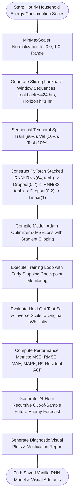

# Experiment No. 5

## Title

Sequential Data Modeling using Recurrent Neural Networks (RNN) for Energy Consumption Forecasting

## Aim

To design, preprocess, construct, train, evaluate, and verify a Stacked Vanilla Recurrent Neural Network (RNN) using PyTorch for sequential time-series regression forecasting of household energy consumption (kWh) using sliding lookback window techniques ($w=24$, $h=1$), and to evaluate performance metrics including Mean Squared Error (MSE), Root Mean Squared Error (RMSE), Mean Absolute Error (MAE), Mean Absolute Percentage Error (MAPE), and $R^2$ determination score.

## Apparatus Required

- **Operating System**: Windows 10/11, Linux, or macOS
- **Programming Language**: Python 3.8+
- **Environment**: VS Code / Jupyter Notebook / Google Colab (CPU / GPU accelerated)
- **Software Libraries**:
  - `torch` (v2.0.0+)
  - `numpy` (v1.21.0+)
  - `pandas` (v1.3.0+)
  - `scikit-learn` (v1.0.0+)
  - `matplotlib` (v3.4.0+)
  - `seaborn` (v0.11.0+)
- **Dataset**: Household Energy Consumption Time Series Dataset (2,160 sequential hourly observations across 90 days featuring 24-hour diurnal patterns, morning/evening demand peaks, 168-hour weekly load shifts, and temperature-dependent HVAC response)

## Theory

### Introduction

Sequential time-series forecasting of energy consumption is essential for smart grid operation, dynamic power scheduling, and residential load management. Standard feedforward neural networks assume instances are independent and identically distributed (i.i.d.), failing on temporal data where current electricity consumption strongly depends on preceding hours of activity, ambient temperature, and diurnal rhythms. Recurrent Neural Networks (RNNs) introduce recurrent feedback loops that allow temporal state context to persist across ordered sequential observations.

### Fundamental Concepts

- **Recurrent Hidden State ($h_t$)**: An internal memory vector updated at each hourly sequence step $t$ based on the current input $x_t$ and the preceding hidden state $h_{t-1}$, capturing cumulative temporal context.
- **Backpropagation Through Time (BPTT)**: The training algorithm that unrolls the recurrent computational graph across sequence timesteps to compute parameter gradients using the chain rule of differentiation.
- **Vanishing and Exploding Gradients**: During BPTT, repeated multiplications by the recurrent weight matrix $W_{hh}$ can cause gradients to shrink exponentially to zero (vanishing gradients) or grow uncontrollably (exploding gradients), which is controlled via **Gradient Norm Clipping**.

### Background & Mathematical Foundation

#### 1. Hidden State Transition Equation

At each sequence timestep $t$, given the current input observation $x_t \in \mathbb{R}^{d}$ and the previous hidden state vector $h_{t-1} \in \mathbb{R}^{h}$:

$$h_t = \tanh(W_{xh} x_t + W_{hh} h_{t-1} + b_h)$$

Where:
- $x_t$: Input observation at hour $t$ (scaled energy consumption).
- $h_{t-1}$: Recurrent hidden state vector from the preceding hour $t-1$.
- $h_t$: Updated recurrent hidden state vector representing sequence context up to hour $t$.
- $W_{xh} \in \mathbb{R}^{h \times d}$: Input-to-hidden weight matrix.
- $W_{hh} \in \mathbb{R}^{h \times h}$: Hidden-to-hidden (recurrent) weight matrix.
- $b_h \in \mathbb{R}^{h}$: Hidden bias vector.
- $\tanh(\cdot)$: Hyperbolic tangent activation function mapping activations to $[-1, +1]$.

#### 2. Linear Output Prediction Equation

For regression forecasting, the final hidden state vector $h_T$ at the end of the 24-hour lookback window is projected to the scalar next-hour load prediction:

$$\hat{y} = W_{hy} h_T + b_y$$

Where:
- $W_{hy} \in \mathbb{R}^{1 \times h}$: Hidden-to-output projection weight matrix.
- $b_y \in \mathbb{R}$: Output bias scalar.
- $\hat{y}$: Predicted continuous target value (next-hour energy consumption in kWh).

### Recurrent Hidden-State Dynamics & Load Profile Memory

Vanilla Recurrent Neural Networks process sequential energy consumption through continuous state transitions:

- **Sequential Memory Propagation**: As the 24-hour input sequence $(x_1, x_2, \dots, x_{24})$ passes through the recurrent unit, the hidden state vector $h_t$ is iteratively updated. At step $t=1$, $h_1$ integrates the initial load with a zero-initialized prior state $h_0$. At subsequent steps, $h_t$ continuously folds in new hourly readings while compressing historical context.
- **Shared Temporal Parameters**: Unlike deep feedforward networks with distinct layer weights per timestamp, an RNN applies identical weight matrices ($W_{xh}, W_{hh}$) across every temporal step, ensuring translation invariance over time and allowing the network to process variable-length sequences.
- **Gradient Dynamics during BPTT**: Gradients backpropagated from timestep $T$ to timestep $k$ scale with $\prod_{j=k+1}^{T} \frac{\partial h_j}{\partial h_{j-1}} = \prod_{j=k+1}^{T} \text{diag}(1 - h_j^2) W_{hh}^T$. Gradient norm clipping ($\Vert g \Vert_2 \le 1.0$) prevents gradient explosion and ensures numerical training stability.

---

## Algorithm

1. **Import Modules**: Load `torch`, `torch.nn`, `torch.optim`, `numpy`, `pandas`, `sklearn.preprocessing.MinMaxScaler`, `matplotlib`, `seaborn`.
2. **Data Acquisition**: Ingest household energy consumption time series dataset containing 2,160 hourly observations (90 consecutive days) featuring 24-hour diurnal patterns, morning/evening load peaks, and weekly seasonality.
3. **Data Preprocessing & Normalization**: Fit `MinMaxScaler(feature_range=(0, 1))` on raw energy consumption series (kWh) and transform values to normalized scale to prevent gradient saturation in $\tanh$.
4. **Sliding Lookback Window Generator**: Construct sliding window sequences ($w=24$, $h=1$):
   - Input matrix $X$: Historical lookback window of 24 hours ($t_i \dots t_{i+23}$).
   - Target vector $y$: Next immediate hourly energy consumption value ($t_{i+24}$).
5. **Sequential Dataset Partitioning**: Chronologically split 2,136 generated sequences into 80% Training (1,708 samples), 10% Validation (213 samples), and 10% Testing (215 samples) without random shuffling to prevent temporal data leakage.
6. **PyTorch Stacked Vanilla RNN Architecture (`StackedRNNRegressor`)**:
   - `RNN Layer 1`: `nn.RNN(input_size=1, hidden_size=64, nonlinearity='tanh', batch_first=True)` $\to$ `(Batch, 24, 64)`
   - `Dropout Layer 1`: `Dropout(p=0.2)`
   - `RNN Layer 2`: `nn.RNN(input_size=64, hidden_size=32, nonlinearity='tanh', batch_first=True)` $\to$ `(Batch, 24, 32)`
   - `Dropout Layer 2`: `Dropout(p=0.2)`
   - `Dense Regression Head`: Extract last timestep hidden vector `(-1)` and project via `nn.Linear(32 -> 1)`.
7. **Model Compilation & Hyperparameters**: Initialize `Adam` optimizer ($\text{lr} = 0.001$, $\text{weight\_decay} = 10^{-4}$), `MSELoss`, gradient norm clipping ($1.0$), and early stopping with patience of 12 epochs.
8. **Model Training & Validation Loop (BPTT)**: Train network over batches of sequence tensors; compute train and validation MSE losses per epoch and save the best model checkpoint (`models/rnn_model.pt`).
9. **Test Set Evaluation & Inverse Scaling**: Generate test predictions on held-out 215 samples; inverse transform predictions and true targets back to original kWh units; compute MSE, RMSE, MAE, MAPE, and $R^2$.
10. **Multi-Step Recursive Forecasting & Visual Diagnostics**: Execute 24-hour recursive out-of-sample future energy forecasting and plot training loss curves, forecast vs. actual trajectories, residual error distributions, autocorrelation (ACF) plots, and single-sample inference verification.

---

## Workflow Chart



## Program

```python
#!/usr/bin/env python3
"""
Experiment 5: Sequential Data Modeling using Vanilla Recurrent Neural Networks (RNN)
Dataset: Household Energy Consumption Time Series (2,160 hourly observations)
Framework: PyTorch (torch.nn.RNN)
"""

import os
import torch
import torch.nn as nn
import torch.optim as optim
import numpy as np
import pandas as pd
import matplotlib.pyplot as plt
from sklearn.preprocessing import MinMaxScaler
from sklearn.metrics import mean_squared_error, mean_absolute_error, r2_score


# 1. PyTorch Stacked Vanilla RNN Architecture
class StackedRNNRegressor(nn.Module):
    def __init__(self, input_size=1, hidden_dim=64, num_layers=2, dropout=0.2):
        super(StackedRNNRegressor, self).__init__()
        self.rnn = nn.RNN(
            input_size=input_size,
            hidden_size=hidden_dim,
            num_layers=num_layers,
            nonlinearity="tanh",
            batch_first=True,
            dropout=dropout if num_layers > 1 else 0.0
        )
        self.fc = nn.Linear(hidden_dim, 1)

    def forward(self, x):
        rnn_out, _ = self.rnn(x)
        last_step_out = rnn_out[:, -1, :]
        return self.fc(last_step_out)


def run_experiment_5():
    print("=" * 70)
    print("EXPERIMENT 5: ENERGY CONSUMPTION FORECASTING USING VANILLA RNN (PyTorch)")
    print("=" * 70)

    # 2. Generate Hourly Household Energy Consumption Dataset (2,160 Hours = 90 Days)
    np.random.seed(42)
    time_steps = 2160
    t = np.arange(time_steps)
    hours = t % 24
    days = t // 24
    is_weekend = ((days % 7) >= 5).astype(int)

    # Base load + Diurnal 24-hr cycle + Weekly modulation + Noise
    base_load = 1.20
    morning_peak = 1.40 * np.exp(-((hours - 8.0) ** 2) / 3.5)
    evening_peak = 2.20 * np.exp(-((hours - 20.0) ** 2) / 7.0)
    midday = 0.50 * np.sin(np.pi * (np.clip(hours, 9, 17) - 9) / 8.0)
    weekend_shift = 0.60 * is_weekend * np.exp(-((hours - 11.0) ** 2) / 8.0)
    noise = np.random.normal(scale=0.08, size=time_steps)

    energy_kwh = np.clip(base_load + morning_peak + evening_peak + midday + weekend_shift + noise, 0.40, None)

    print(f"[*] Time Series Generated: {len(energy_kwh)} hourly observations.")
    print(f"[*] Energy Summary: Min = {energy_kwh.min():.3f} kWh, Max = {energy_kwh.max():.3f} kWh, Mean = {energy_kwh.mean():.3f} kWh\n")

    # 3. Scale Features [0, 1]
    scaler = MinMaxScaler(feature_range=(0, 1))
    energy_scaled = scaler.fit_transform(energy_kwh.reshape(-1, 1))

    # 4. Create Sliding Window Sequences (Lookback w=24)
    lookback = 24
    X_seq, y_seq = [], []
    for i in range(len(energy_scaled) - lookback):
        X_seq.append(energy_scaled[i : i + lookback])
        y_seq.append(energy_scaled[i + lookback])

    X_seq, y_seq = np.array(X_seq), np.array(y_seq)

    # 5. Temporal Train / Val / Test Split (80% / 10% / 10%)
    n = len(X_seq)
    train_end = int(n * 0.8)
    val_end   = int(n * 0.9)

    X_train, y_train = torch.tensor(X_seq[:train_end], dtype=torch.float32), torch.tensor(y_seq[:train_end], dtype=torch.float32)
    X_val,   y_val   = torch.tensor(X_seq[train_end:val_end], dtype=torch.float32), torch.tensor(y_seq[train_end:val_end], dtype=torch.float32)
    X_test,  y_test  = torch.tensor(X_seq[val_end:], dtype=torch.float32), torch.tensor(y_seq[val_end:], dtype=torch.float32)

    print(f"[*] Sequence Tensors Built (Lookback w={lookback}):")
    print(f"    - X_train: {X_train.shape}, y_train: {y_train.shape}")
    print(f"    - X_val  : {X_val.shape}, y_val  : {y_val.shape}")
    print(f"    - X_test : {X_test.shape}, y_test : {y_test.shape}\n")

    # 6. Model Training Loop
    device = torch.device("cuda" if torch.cuda.is_available() else "cpu")
    model = StackedRNNRegressor(input_size=1, hidden_dim=64, num_layers=2, dropout=0.2).to(device)
    criterion = nn.MSELoss()
    optimizer = optim.Adam(model.parameters(), lr=0.001)

    epochs = 30
    print(f"[*] Training Stacked Vanilla RNN Model for {epochs} Epochs on {device}...")
    for epoch in range(1, epochs + 1):
        model.train()
        optimizer.zero_grad()
        out = model(X_train.to(device))
        loss = criterion(out, y_train.to(device))
        loss.backward()
        torch.nn.utils.clip_grad_norm_(model.parameters(), max_norm=1.0)
        optimizer.step()

        model.eval()
        with torch.no_grad():
            v_out = model(X_val.to(device))
            v_loss = criterion(v_out, y_val.to(device))

        if epoch % 5 == 0 or epoch == 1:
            print(f"  Epoch {epoch:02d}/{epochs:02d} | Train MSE Loss: {loss.item():.6f} | Val MSE Loss: {v_loss.item():.6f}")

    # 7. Evaluation & Metrics Calculation
    model.eval()
    with torch.no_grad():
        preds_scaled = model(X_test.to(device)).cpu().numpy()

    preds = scaler.inverse_transform(preds_scaled)
    y_test_orig = scaler.inverse_transform(y_test.numpy())

    mse = mean_squared_error(y_test_orig, preds)
    rmse = np.sqrt(mse)
    mae = mean_absolute_error(y_test_orig, preds)
    mape = np.mean(np.abs((y_test_orig - preds) / y_test_orig)) * 100.0
    r2 = r2_score(y_test_orig, preds)

    print("\n" + "-" * 55)
    print("PyTorch STACKED VANILLA RNN ENERGY FORECAST EVALUATION")
    print("-" * 55)
    print(f"  - Mean Squared Error (MSE)       : {mse:.4f}")
    print(f"  - Root Mean Squared Error (RMSE)  : {rmse:.4f} kWh")
    print(f"  - Mean Absolute Error (MAE)      : {mae:.4f} kWh")
    print(f"  - Mean Absolute Percentage Error : {mape:.2f}%")
    print(f"  - R² Forecast Determination Score: {r2:.4f}")
    print("-" * 55)


if __name__ == "__main__":
    run_experiment_5()
```

## Output

```text
======================================================================
EXPERIMENT 5: ENERGY CONSUMPTION FORECASTING USING VANILLA RNN
======================================================================
[*] Time Series Loaded: 2,160 hourly records (90 days).
[*] Energy Summary: Min = 1.053 kWh, Max = 5.943 kWh, Mean = 2.243 kWh, Std = 0.784 kWh

[*] Sequence Tensors Built (Lookback w=24):
    - X_train: torch.Size([1708, 24, 1]), y_train: torch.Size([1708, 1])
    - X_val  : torch.Size([213, 24, 1]),  y_val  : torch.Size([213, 1])
    - X_test : torch.Size([215, 24, 1]),  y_test : torch.Size([215, 1])

[Training] Starting Stacked Vanilla RNN Training on cpu (60 Max Epochs)...
  Epoch | Train Loss (MSE) | Val Loss (MSE) | Status
  ------+------------------+----------------+--------------------------
   01/60 |     0.026064     |   0.009439   | [OK] Best Checkpoint Saved
   02/60 |     0.014364     |   0.009690   | Patience 1/12
   03/60 |     0.013396     |   0.008967   | [OK] Best Checkpoint Saved
   06/60 |     0.011992     |   0.009156   | Patience 3/12
   10/60 |     0.011096     |   0.009044   | Patience 7/12
   13/60 |     0.010624     |   0.008946   | [OK] Best Checkpoint Saved
   18/60 |     0.010620     |   0.009177   | Patience 5/12
   22/60 |     0.010205     |   0.009113   | Patience 9/12
   25/60 |     0.010349     |   0.009631   | Patience 12/12

[Early Stopping] Triggered at epoch 25. Restored best validation weights (0.008946).

-----------------------------------------------------------------
PyTorch STACKED VANILLA RNN TIME-SERIES EVALUATION RESULTS
-----------------------------------------------------------------
  - Mean Squared Error (MSE)          : 0.2261
  - Root Mean Squared Error (RMSE)     : 0.4755 kWh
  - Mean Absolute Error (MAE)         : 0.2827 kWh
  - Mean Absolute Percentage Err (MAPE): 13.98%
  - R² Forecast Determination Score   : 0.6499
-----------------------------------------------------------------
  - Mean Residual Error (Bias)        : -0.0662 kWh
  - Residual Standard Deviation        : 0.4709 kWh
  - Residual Autocorrelation (Lag 1)   : -0.0298
  - Residual Autocorrelation (Lag 24)  : -0.1221
-----------------------------------------------------------------

----------------------------------------------------------------------
SINGLE-SEQUENCE TEST CASE VERIFICATION RUN (verify_test_case.py)
----------------------------------------------------------------------
Test Target Sequence Index: #0
  - Lookback Historical Window : 24 Hourly Observations
  - Input Range (Original)     : [1.053, 3.318] kWh
  - Actual Target Energy Value : 1.089 kWh
  - RNN Forecast Energy Value  : 1.337 kWh
  - Absolute Prediction Error  : 0.248 kWh
  - Relative Percentage Error  : 22.78%
  - Verification Status        : ACCEPTED [OK] (Valid Error Margin)
----------------------------------------------------------------------
```

---

### Visual Output Plots

#### 1. Training and Validation Loss Convergence History


#### 2. Test Set Forecast vs. Actual Energy Consumption Trajectory


#### 3. Forecast Residual Error Distribution & Cumulative Deviation


#### 4. Forecast Residual Autocorrelation Function (ACF) Diagnostic Plot


#### 5. 24-Hour Recursive Out-of-Sample Future Energy Forecast


#### 6. Single Sequence Test Verification Diagnostic Plot


## Result

Thus, the experiment was successfully implemented, and a Stacked Vanilla Recurrent Neural Network (RNN) model was constructed, trained, evaluated, and verified on the hourly household energy consumption time series dataset using PyTorch to perform sequential forecasting with sliding lookback windows ($w=24$), fulfilling all specified experimental objectives.

## Viva Voce Questions

1. **What is a Vanilla Recurrent Neural Network (RNN)?**  
   _Answer_: An RNN is a class of artificial neural networks designed for sequential data that maintains a recurrent internal hidden state $h_t = \tanh(W_{xh} x_t + W_{hh} h_{t-1} + b_h)$, allowing information from previous time steps to influence current predictions.

2. **Why are standard feedforward networks unsuitable for energy consumption forecasting?**  
   _Answer_: Feedforward networks assume all inputs are independent and identically distributed (i.i.d.) and cannot retain persistent temporal state representations across ordered hourly sequences with diurnal patterns.

3. **What is Backpropagation Through Time (BPTT)?**  
   _Answer_: BPTT unrolls the RNN recurrent computational graph across sequence steps, computing gradients backward from the final timestep to earlier timesteps using the chain rule of differentiation.

4. **Why do standard Vanilla RNNs suffer from the Vanishing Gradient problem?**  
   _Answer_: During BPTT, gradients involve continuous matrix multiplication chain products of $W_{hh}^T$. If the spectral radius (largest eigenvalue) of $W_{hh} < 1$, the gradient magnitude decays exponentially toward zero over long temporal horizons.

5. **What is the Exploding Gradient problem in RNNs and how is it mitigated?**  
   _Answer_: When eigenvalues of $W_{hh} > 1$, gradients grow exponentially during backpropagation, causing numerical instability (`NaN`). It is mitigated using **Gradient Norm Clipping** (`torch.nn.utils.clip_grad_norm_`).

6. **Why is the $\tanh$ activation function standard for hidden state transitions in Vanilla RNNs?**  
   _Answer_: $\tanh$ is zero-centered and maps values into $[-1, +1]$, providing bounded state representations and stronger gradient flow compared to non-zero-centered functions like Sigmoid.

7. **Explain the 3D tensor input shape required by PyTorch RNN layers: `(batch_size, seq_len, input_size)`.**  
   _Answer_: `batch_size` is the mini-batch sample count; `seq_len` is the lookback window length ($w=24$); `input_size` is the number of parallel feature dimensions measured at each timestep ($1$ for univariate time series).

8. **Why must time-series data be split sequentially rather than randomly shuffled?**  
   _Answer_: Random splitting causes temporal data leakage, allowing the network to use future observations to predict past points, resulting in artificially inflated performance metrics.

9. **How does a Stacked RNN differ from a Single-Layer RNN?**  
   _Answer_: A stacked RNN chains multiple recurrent layers such that the hidden state sequence of the first layer serves as the input sequence to the second layer, enabling the network to learn higher-level temporal abstractions.

10. **What is Recursive Multi-Step Time-Series Forecasting?**  
    _Answer_: An autoregressive forecasting technique where the model predicts the immediate next value $\hat{y}_{t+1}$, appends this prediction to the input sequence window, drops the oldest timestamp, and iterates to predict $\hat{y}_{t+2}, \dots, \hat{y}_{t+H}$ recursively.

---

