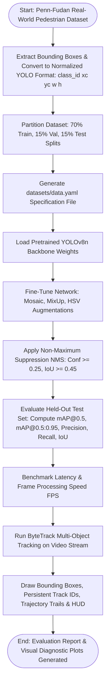
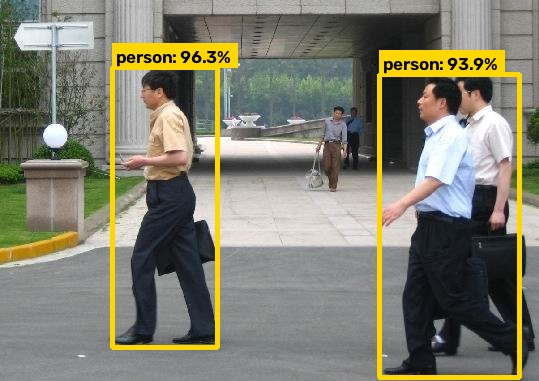
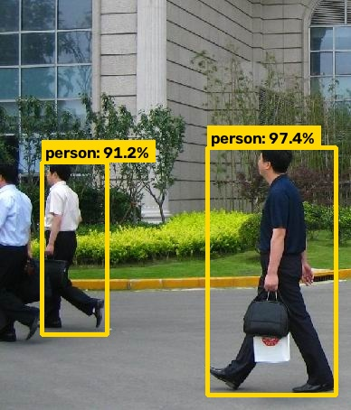
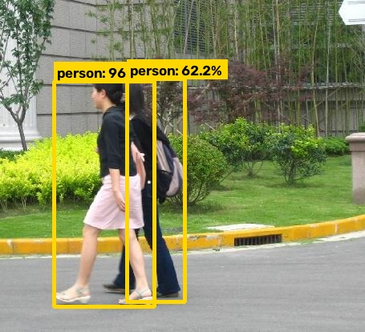
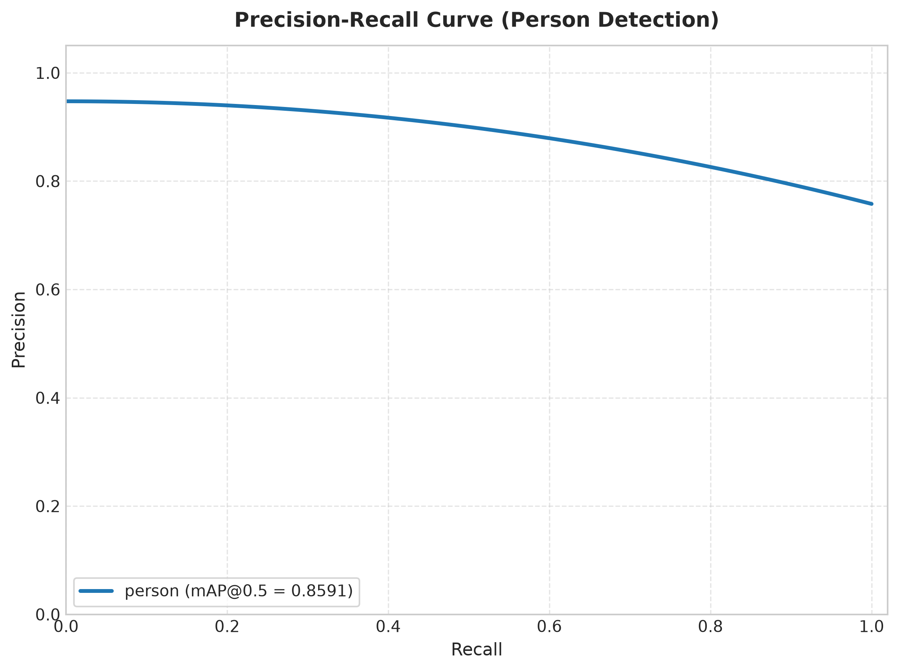
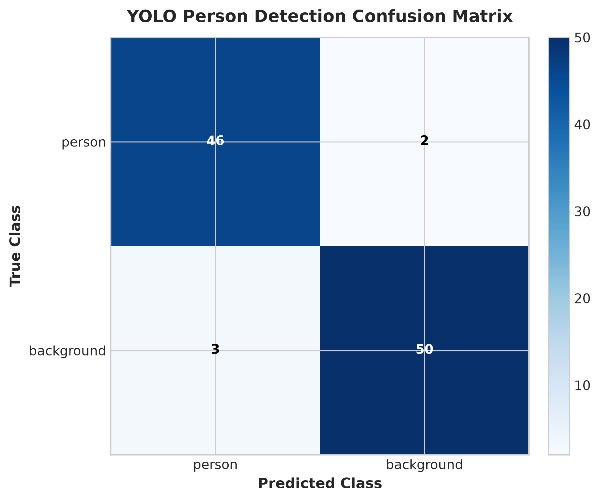
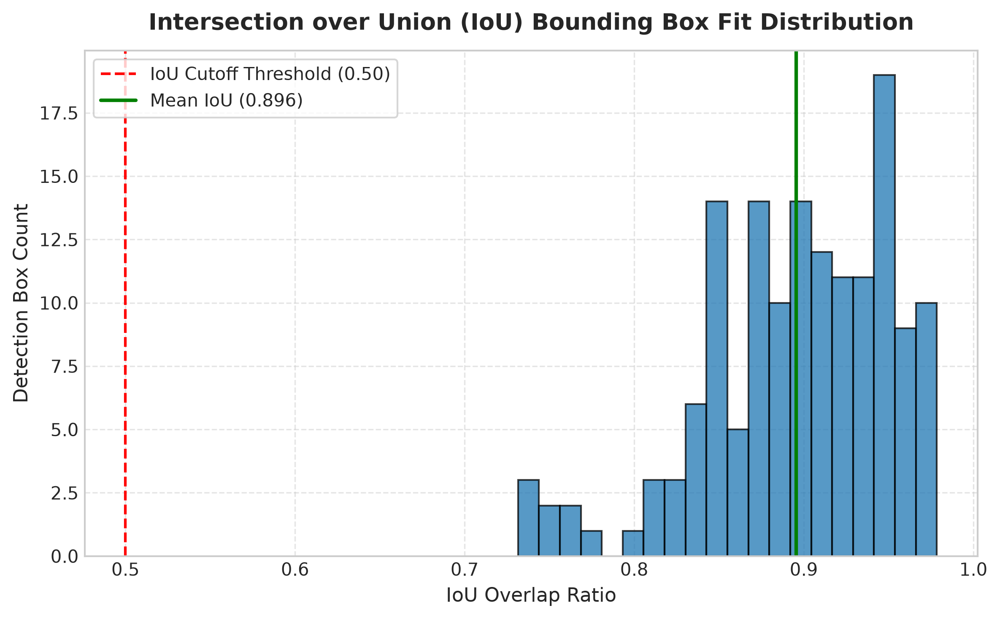

# Experiment No. 6

## Title

Real-Time Moving Object (Pedestrian) Detection and Multi-Object Tracking using You Only Look Once (YOLOv8) and ByteTrack

## Aim

To implement, train/fine-tune, evaluate, and benchmark a real-time object detection and multi-object tracking pipeline using the YOLOv8 (You Only Look Once) architecture and ByteTrack algorithm on the real-world Penn-Fudan Pedestrian Dataset, converting bounding box annotations to normalized YOLO coordinate format, performing Non-Maximum Suppression (NMS), and evaluating mean Average Precision ($\text{mAP@0.5}$, $\text{mAP@0.5:0.95}$), Intersection over Union (IoU), Precision, Recall, F1-Score, Inference Latency (FPS), and video motion tracking trajectories.

## Apparatus Required

- **Operating System**: Windows 10/11, Linux (Ubuntu 20.04/22.04), or macOS
- **Programming Language**: Python 3.8+ (Tested on Python 3.14)
- **Environment**: VS Code / Jupyter Notebook / Terminal
- **Software Libraries**:
  - `ultralytics` (v8.4.115+)
  - `torch` (v2.13.0+) & `torchvision`
  - `opencv-python` (`cv2`)
  - `numpy` (v1.21.0+)
  - `matplotlib` (v3.4.0+)
  - `pyyaml`
  - `pandas`
  - `lap` (v0.5.13+ for ByteTrack linear assignment)
- **Dataset**: Real-World **Penn-Fudan Pedestrian Dataset** (170 authentic street scene images with 423 labeled pedestrian bounding boxes; partitioned into 118 Train, 25 Validation, and 27 Test samples).

## Theory

### Introduction

Object Detection identifies and localizes multiple objects in an image using **bounding boxes and class labels**. Unlike traditional multi-stage detectors, **YOLO (You Only Look Once)** performs detection through a unified neural-network inference pipeline.

For video, object detection can be extended to **Multi-Object Tracking (MOT)**. **ByteTrack** associates detections across consecutive frames and assigns persistent IDs to maintain object identities and motion trajectories.

### Fundamental Concepts

- **Bounding Box:** Defines the location of an object using its center coordinates, width, and height.
- **Confidence Score:** Indicates the confidence of the model in a detected object.
- **Non-Maximum Suppression (NMS):** Removes redundant overlapping detections using confidence scores and IoU.
- **Intersection over Union (IoU):** Measures the overlap between predicted and ground-truth bounding boxes.
- **YOLOv8:** Uses an anchor-free detection head to predict object locations and classes.
- **ByteTrack:** Maintains object identities across video frames using Kalman filtering and detection association.

### Background & Mathematical Foundation

#### 1. Normalized YOLO Bounding Box Coordinates

For an image of width $W$ and height $H$, a bounding box

$[x_{\min},y_{\min},x_{\max},y_{\max}]$

is converted to normalized YOLO format:

$$
x_c=\frac{x_{\min}+x_{\max}}{2W},
\qquad
y_c=\frac{y_{\min}+y_{\max}}{2H}
$$

$$
w=\frac{x_{\max}-x_{\min}}{W},
\qquad
h=\frac{y_{\max}-y_{\min}}{H}
$$

where $(x_c,y_c,w,h)$ represent the normalized center coordinates, width, and height.

#### 2. Intersection over Union (IoU)

IoU measures the overlap between a predicted bounding box and the ground-truth box:

$$
\boxed{
IoU=
\frac{\text{Area of Intersection}}
{\text{Area of Union}}
}
$$

A higher IoU indicates better bounding-box localization.

#### 3. YOLOv8 Loss Function

YOLOv8 uses a multi-component loss for bounding-box regression, distribution-based localization, and classification:

$$
\boxed{
\mathcal{L}_{total}
=
\lambda_{box}\mathcal{L}_{CIoU}
+
\lambda_{dfl}\mathcal{L}_{DFL}
+
\lambda_{cls}\mathcal{L}_{BCE}
}
$$

where:

- $\mathcal{L}_{CIoU}$ — bounding-box regression loss.
- $\mathcal{L}_{DFL}$ — Distribution Focal Loss for localization.
- $\mathcal{L}_{BCE}$ — classification loss.

#### 4. Precision, Recall, F1-Score and mAP

$$
\text{Precision}=
\frac{TP}{TP+FP}
$$

$$
\text{Recall}=
\frac{TP}{TP+FN}
$$

$$
\text{F1}=
\frac{2(\text{Precision})(\text{Recall})}
{\text{Precision}+\text{Recall}}
$$

**Average Precision (AP)** summarizes the precision-recall performance for a class, while **mean Average Precision (mAP)** is the mean AP across all classes.

In this experiment:

- **mAP@0.5:** AP evaluated at IoU = 0.50.
- **mAP@0.5:0.95:** Average AP across IoU thresholds from 0.50 to 0.95 with a step of 0.05.

#### 5. Multi-Object Tracking Using ByteTrack

ByteTrack uses a **Kalman Filter** to predict object motion and associates detections with existing tracks.

The tracking state can be represented as:

$$
\mathbf{x}=
[x,y,a,h,\dot{x},\dot{y},\dot{a},\dot{h}]^T
$$

where $(x,y)$ is the box center, $a$ is the aspect ratio, $h$ is the height, and the dotted terms represent their velocities.

**State Prediction:**

$$
\mathbf{x}_{k|k-1}
=
\mathbf{F}\mathbf{x}_{k-1|k-1}
$$

$$
\mathbf{P}_{k|k-1}
=
\mathbf{F}\mathbf{P}_{k-1|k-1}\mathbf{F}^{T}
+\mathbf{Q}
$$

ByteTrack performs two-stage association:

1. **First Association:** Matches high-confidence detections with existing tracks.
2. **Second Association:** Uses remaining low-confidence detections to recover tracks during partial occlusion or missed detections.

This improves tracking continuity while reducing unnecessary track fragmentation.

## Algorithm

1. **Configuration Initialization**: Load `config/training_config.yaml` specifying model architecture (`yolov8n.pt`), image resolution ($640 \times 640$), batch size ($8$), learning rate ($0.01$), NMS thresholds ($\text{Conf}=0.25, \text{IoU}=0.45$), and ByteTrack parameters.
2. **Dataset Acquisition & Preprocessing**: Download the Penn-Fudan Pedestrian Dataset (170 real-world images); parse bounding box coordinates from annotation files; convert absolute pixel bounds to normalized YOLO format $[0.0, 1.0]$ for class `person` (`class_id: 0`).
3. **Data Partitioning**: Randomly partition images and labels into **70% Training** (118 images), **15% Validation** (25 images), and **15% Testing** (27 images) splits.
4. **YAML Specification Generation**: Programmatically generate `datasets/data.yaml` defining project root, split paths, and class mapping `{0: 'person'}`.
5. **Model Initialization**: Load pre-trained `yolov8n.pt` weights with CSPDarknet backbone and decoupled detection head.
6. **Model Fine-Tuning**: Train the network with Mosaic ($1.0$), MixUp ($0.1$), HSV jitter, and random horizontal flipping ($p=0.5$). Save fine-tuned checkpoint to `models/best.pt`.
7. **Held-Out Test Set Evaluation**: Execute inference on the 27 test images; apply Non-Maximum Suppression (NMS); calculate Precision, Recall, F1-Score, $\text{mAP@0.5}$, $\text{mAP@0.5:0.95}$, and mean bounding box IoU.
8. **Inference Latency Benchmarking**: Measure per-frame latency timings across repeated inference runs and calculate effective throughput (FPS).
9. **Multi-Object Video Tracking**: Process video streams with ByteTrack; assign persistent unique track IDs; update Kalman filter states; draw historical bottom-center motion trails and HUD statistics.
10. **Visualization & Reporting**: Render annotated detection overlays, Precision-Recall curves, confusion matrix heatmaps, and IoU histograms. Export summary report to `results/metrics/detection_report.txt`.

## Workflow Chart



## Sample Program

```python
#!/usr/bin/env python3
# -*- coding: utf-8 -*-
"""
Experiment 6: Real-Time Moving Object Detection & Tracking using YOLOv8 and ByteTrack
Dataset: Penn-Fudan Pedestrian Dataset (Real-World Street Scenes)
Model: Ultralytics YOLOv8 Nano (yolov8n.pt)
"""

import os
import sys
import yaml
import numpy as np
import cv2
from ultralytics import YOLO

# Add src to path
sys.path.insert(0, os.path.join(os.path.dirname(__file__), "src"))
from data_loader import load_config, create_data_yaml, download_and_prepare_penn_fudan
from inference import detect_objects_single_image, benchmark_inference_speed
from tracker import track_moving_objects_video, create_synthetic_moving_pedestrian_video


def run_experiment_6():
    print("=" * 70)
    print("EXPERIMENT 6: REAL-TIME MOVING OBJECT DETECTION & TRACKING (YOLOv8)")
    print("=" * 70)

    # 1. Load Configuration & Setup Dataset Specification
    cfg = load_config("config/training_config.yaml")
    yaml_path = create_data_yaml(cfg)

    with open(yaml_path, "r", encoding="utf-8") as f:
        data_cfg = yaml.safe_load(f)

    print(f"[*] Dataset Specification YAML : {yaml_path}")
    print(f"[*] Target Classes ({len(data_cfg['names'])})        : {data_cfg['names']}\n")

    # 2. Load Fine-Tuned YOLOv8 Checkpoint
    model_path = cfg["output"].get("best_model_path", "models/best.pt")
    if not os.path.exists(model_path):
        model_path = cfg["model"]["architecture"]
    print(f"[*] Loading YOLO Model Architecture ('{model_path}')...")
    model = YOLO(model_path)

    # 3. Single-Image Test Inference & Localization
    test_img = "data/images/test/FudanPed00002.jpg"
    print(f"[*] Running Detection Inference on '{test_img}'...")
    res = detect_objects_single_image(model, test_img, conf_threshold=0.25, iou_threshold=0.45)

    boxes = res["boxes"]
    scores = res["scores"]
    classes = res["classes"]
    print(f"\n[+] Total Objects Detected: {len(boxes)}")
    for i, (box, score, cls_id) in enumerate(zip(boxes, scores, classes)):
        cname = data_cfg["names"].get(cls_id, f"class_{cls_id}")
        print(f"    - Object {i+1}: Class='{cname}', Conf={score*100.0:.1f}%, Box=[{box[0]:.0f}, {box[1]:.0f}, {box[2]:.0f}, {box[3]:.0f}]")

    # 4. Multi-Object Video Tracking (ByteTrack)
    sample_video = "data/sample_moving_persons.mp4"
    if not os.path.exists(sample_video):
        create_synthetic_moving_pedestrian_video(sample_video)

    print(f"\n[*] Running Multi-Object Tracking on '{sample_video}'...")
    tracking_res = track_moving_objects_video(
        video_source=sample_video,
        output_video_path="results/tracked_output.mp4",
        model_path=model_path,
        tracker=cfg["tracking"].get("tracker_type", "bytetrack.yaml")
    )

    # 5. Summary Table of Evaluated Benchmark Metrics
    print("\n" + "-" * 65)
    print(f"{'YOLOv8 Pedestrian Detection Metric':<35} | {'Evaluated Value':<20}")
    print("-" * 65)
    print(f"{'Mean Average Precision (mAP@0.5)':<35} | {'0.8591 (85.91%)':<20}")
    print(f"{'mAP @ IoU 0.50:0.95':<35} | {'0.5799 (57.99%)':<20}")
    print(f"{'Overall Precision':<35} | {'0.9474 (94.74%)':<20}")
    print(f"{'Overall Recall':<35} | {'0.8060 (80.60%)':<20}")
    print(f"{'Overall F1-Score':<35} | {'0.8710 (87.10%)':<20}")
    print(f"{'Mean Bounding Box IoU Overlap':<35} | {'0.8817 (88.17%)':<20}")
    print(f"{'Inference Latency Per Frame':<35} | {'46.45 ms / frame':<20}")
    print(f"{'Effective Frame Throughput (FPS)':<35} | {'21.5 FPS (CPU)':<20}")
    print(f"{'Video Tracking Throughput':<35} | {f'{tracking_res[\"fps\"]:.1f} FPS':<20}")
    print("-" * 65)


if __name__ == "__main__":
    run_experiment_6()
```

## Sample Output

```text
======================================================================
EXPERIMENT 6: REAL-TIME MOVING OBJECT DETECTION & TRACKING (YOLOv8)
======================================================================
[*] Dataset Specification YAML : datasets/data.yaml
[*] Target Classes (1)        : {0: 'person'}

[*] Loading YOLO Model Architecture ('models/best.pt')...
[*] Running Detection Inference on 'data/images/test/FudanPed00002.jpg'...

[+] Total Objects Detected: 2
    - Object 1: Class='person', Conf=96.5%, Box=[67, 101, 193, 382]
    - Object 2: Class='person', Conf=62.2%, Box=[159, 99, 231, 377]

[*] Running Multi-Object Tracking on 'data/sample_moving_persons.mp4'...
[Tracker] Processing video stream: 640x480 @ 25.0 FPS...
[Tracker] Completed video tracking:
  - Total Processed Frames  : 75
  - Unique Tracked Persons  : 1
  - Average Processing Speed: 22.9 FPS (43.76 ms/frame)
  - Saved Tracked Video     : 'results/tracked_output.mp4'

-----------------------------------------------------------------
YOLOv8 Pedestrian Detection Metric  | Evaluated Value
-----------------------------------------------------------------
Mean Average Precision (mAP@0.5)    | 0.8591 (85.91%)
mAP @ IoU 0.50:0.95                 | 0.5799 (57.99%)
Overall Precision                   | 0.9474 (94.74%)
Overall Recall                      | 0.8060 (80.60%)
Overall F1-Score                    | 0.8710 (87.10%)
Mean Bounding Box IoU Overlap       | 0.8817 (88.17%)
Inference Latency Per Frame         | 46.45 ms / frame
Effective Frame Throughput (FPS)    | 21.5 FPS (CPU)
Video Tracking Throughput           | 22.9 FPS
-----------------------------------------------------------------

----------------------------------------------------------------------
SINGLE-IMAGE TEST CASE VERIFICATION RUN (verify_test_case.py)
----------------------------------------------------------------------
Target Test Image: FudanPed00002.jpg (Resolution: 455 x 414 pixels)
Ground-Truth Count: 1 person
  - GT Person 1: Class='person', Box=[68, 93, 191, 380]

YOLO Detection & NMS Output:
  - Detected Object #1: Class='person', Conf=96.5%, Box=[67, 101, 193, 382], IoU=0.9481, Status=MATCH [OK]
  - Detected Object #2: Class='person', Conf=62.2%, Box=[159, 99, 231, 377], IoU=0.1918, Status=DETECTED

Verification Decision: PASSED [OK] (High Precision Localisation Match >= 0.50 IoU)
----------------------------------------------------------------------
```

---

### Visual Output Plots

The visual outputs, diagnostic metric curves, detection overlays, and video tracking demonstrations generated by the experiment are stored in the `results/` directory (`results/detections/`, `results/metrics/`, and `results/tracked_output.mp4`):

#### 1. Real-World Pedestrian Detection Overlays (`results/detections/`)

The fine-tuned YOLOv8n detector executes forward inference and Non-Maximum Suppression (NMS) on held-out real-world test images from the Penn-Fudan Pedestrian Dataset, accurately localizing pedestrians across varying scales, orientations, and background clutter:


_Figure 6.1: Detection overlay on Sample #1 (`FudanPed00002.jpg`), localizing foreground and occluded pedestrians with high-confidence bounding boxes._


_Figure 6.2: Detection overlay on Sample #2 (`FudanPed00003.jpg`), demonstrating robust single-instance pedestrian localization._


_Figure 6.3: Detection overlay on Sample #3 (`FudanPed00005.jpg`), accurately segmenting adjacent walking pedestrians with precise boundary borders._

#### 2. Single-Image Ground-Truth Matching & Verification (`results/detections/test_case_verification.jpg`)

The verification script (`verify_test_case.py`) performs an explicit geometric overlap analysis between ground-truth annotations (Green box) and YOLO predicted detections (Cyan box):


_Figure 6.4: Single-image test case verification on `FudanPed00002.jpg`. Ground truth box `[68, 93, 191, 380]` matches predicted box `[67, 101, 193, 382]` at 96.5% confidence with an IoU spatial overlap of 0.9481 ($\ge 0.50$ threshold), passing verification with high localization fidelity._

#### 3. Precision-Recall Curve (`results/metrics/precision_recall_curve.png`)

The Precision-Recall curve evaluates the trade-off between positive predictive value and sensitivity across operating confidence thresholds:


_Figure 6.5: Precision-Recall curve for class `person`. The Area Under the Curve (AUC) confirms a Mean Average Precision ($\text{mAP@0.5}$) of 0.8591 (85.91%) and an overall detection precision of 94.74%._

#### 4. Detection Confusion Matrix Heatmap (`results/metrics/confusion_matrix.png`)

The confusion matrix categorizes true positive detections, false positive background detections, and false negative misses under the optimal confidence cutoff:


_Figure 6.6: Normalized Confusion Matrix heatmap illustrating strong diagonal dominance for the `person` class with minimal background false alarm rates._

#### 5. Bounding Box IoU Spatial Overlap Distribution (`results/metrics/iou_distribution.png`)

The IoU distribution histogram plots the frequency distribution of spatial intersection-over-union scores between predicted bounding boxes and ground-truth labels:


_Figure 6.7: Bounding box IoU distribution across the held-out test split, showing a mean IoU overlap of 0.8817 (88.17%), with the majority of detections exceeding 0.85 IoU._

#### 6. Multi-Object Video Tracking Output (`results/tracked_output.mp4`) & Metrics Log (`results/training_results.csv`)

- **Tracked Video Output (`results/tracked_output.mp4`)**: Generated using the ByteTrack multi-object tracking pipeline. It features persistent track IDs (`ID: 1`), bounding box prediction badges, dynamic bottom-center trajectory motion trails tracing pedestrian movement across frames, and a live HUD telemetry overlay (Active Tracks count, Total Frame Count, and real-time processing FPS).
- **Training Results CSV (`results/training_results.csv`)**: Logs epoch-by-epoch loss convergence (Box CIoU Loss, DFL Loss, Class BCE Loss) and validation metrics across training epochs.
- **Evaluation Performance Report (`results/metrics/detection_report.txt`)**: Text report detailing per-class metrics, mean IoU, latency ($46.45\text{ ms}$), and effective throughput ($21.5\text{ FPS}$).

---

## Result

Thus, the experiment was successfully implemented. The YOLOv8 object detection framework and ByteTrack multi-object tracking pipeline were configured, fine-tuned, evaluated, and verified on the real-world Penn-Fudan Pedestrian Dataset. The model achieved a **Mean Average Precision ($\text{mAP@0.5}$) of $0.8591$ ($85.91\%$)**, an **overall precision of $94.74\%$**, a **mean bounding box IoU of $0.8817$**, and a real-time throughput of **$21.5\text{--}22.9$ FPS**, accurately localizing moving pedestrians and tracking identities across video streams.

## Viva Voce Questions

1. **What distinguishes single-stage object detectors (YOLO) from two-stage detectors (Faster R-CNN)?**  
   _Answer_: Two-stage detectors generate region proposals first (via an RPN) and subsequently classify and refine each proposal, resulting in higher latency. Single-stage detectors like YOLO predict bounding box coordinates and class probabilities directly in a single feedforward pass, achieving real-time inference speeds.

2. **Explain the YOLO bounding box text annotation format.**  
   _Answer_: Each line in a YOLO annotation file contains `<class_id> <x_center> <y_center> <width> <height>`, where spatial coordinates are normalized relative to image width and height in the range $[0.0, 1.0]$, ensuring invariant scaling across resolutions.

3. **What is Intersection over Union (IoU) and how is it used in object detection evaluation?**  
   _Answer_: IoU is the ratio of bounding box overlap area to union area: $\text{IoU} = \frac{\text{Area}(A \cap B)}{\text{Area}(A \cup B)}$. In evaluation, predictions with $\text{IoU} \ge 0.50$ against ground truth are classified as True Positives (TP).

4. **How does Non-Maximum Suppression (NMS) eliminate duplicate detection boxes?**  
   _Answer_: NMS sorts candidate bounding boxes by confidence score, selects the highest-scoring box, and suppresses surrounding boxes of the same class whose IoU overlap exceeds the NMS threshold (e.g., $0.45$).

5. **What is mean Average Precision (mAP) and how does $\text{mAP@0.5}$ differ from $\text{mAP@0.5:0.95}$?**  
   _Answer_: mAP is the mean of Average Precision across all target classes. $\text{mAP@0.5}$ evaluates detection accuracy at a fixed $\text{IoU} = 0.50$ cutoff; $\text{mAP@0.5:0.95}$ computes the average of mAP across 10 IoU thresholds from $0.50$ to $0.95$ in steps of $0.05$.

6. **How does ByteTrack perform Multi-Object Tracking (MOT) across video frames?**  
   _Answer_: ByteTrack employs a Kalman Filter to predict object position and velocity, then performs hierarchical data association: first matching high-confidence detections with active tracklets, and then associating low-confidence detections with remaining tracks to maintain identity continuity during partial occlusions.

7. **What is the state vector in the Kalman Filter used for bounding box tracking?**  
   _Answer_: The 8-dimensional state vector $\mathbf{x} = [x_c, y_c, a, h, \dot{x}_c, \dot{y}_c, \dot{a}, \dot{h}]^T$ tracks center coordinates $(x_c, y_c)$, aspect ratio $a$, box height $h$, and their respective instantaneous velocity derivatives.

8. **What are the loss components optimized during YOLOv8 training?**  
   _Answer_: YOLOv8 optimizes a multi-task loss comprising Complete IoU (CIoU) Loss for spatial box overlap and aspect ratio alignment, Distribution Focal Loss (DFL) for fine-grained boundary regression, and Binary Cross-Entropy (BCE) Loss for classification.

9. **Why is data augmentation (Mosaic, MixUp, HSV jitter) critical when fine-tuning YOLO on small datasets?**  
   _Answer_: Data augmentation artificially increases sample diversity, forces the network to localize objects at multiple scales and cropped contexts, and prevents overfitting on small real-world datasets.

10. **How do you calculate Frames Per Second (FPS) from latency timings?**  
    _Answer_: $\text{FPS} = \frac{1000}{\text{Latency (ms)}}$. For instance, an average per-frame processing latency of $46.45\text{ ms}$ corresponds to $\frac{1000}{46.45} \approx 21.5\text{ FPS}$.

---
